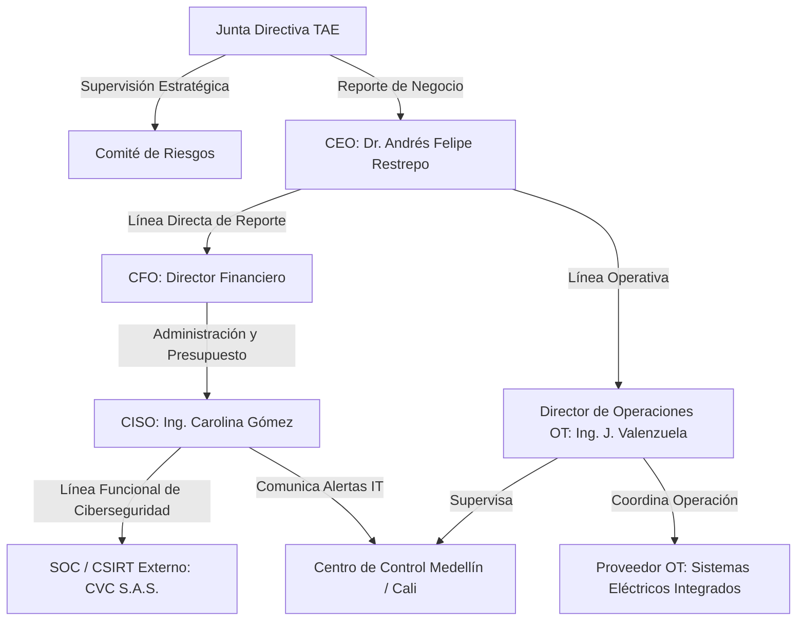
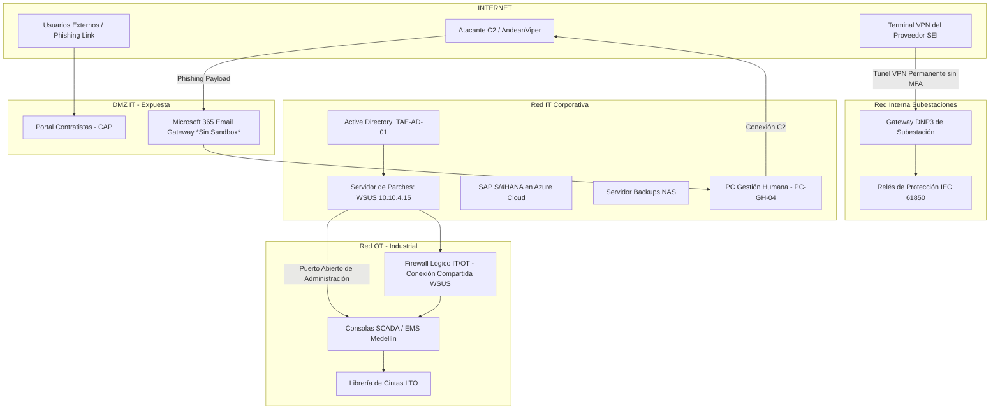

# MAESTRÍA EN CIBERSEGURIDAD Y CIBERDEFENSA
## EVALUACIÓN OFICIAL DE FIN DE PROGRAMA - GESTIÓN DEL RIESGO Y CIBERDEFENSA DE INFRAESTRUCTURAS CRÍTICAS

---

**Asignatura:** Dirección Estratégica de Ciberseguridad y Gestión del Riesgo  
**Caso de Estudio:** *El Silencio de los Interruptores: Gestión del Riesgo en TransAndina de Energía S.A. E.S.P.*  
**Diseño de la Evaluación:** Comité Académico y Técnico de Evaluación de Posgrados  
**Tiempo de Lectura Estimado:** 15 minutos  
**Tiempo de Examen Permitido:** 90 minutos  
**Nivel de Dificultad:** Medio-Alto (Enfoque en Análisis, Inferencia y Toma de Decisiones)  

---

# 1. INTRODUCCIÓN

El sector eléctrico de la República de Colombia se encuentra en una fase de transformación digital acelerada, caracterizada por la integración de sistemas de control industrial (OT) con redes corporativas (IT) y plataformas en la nube. Esta convergencia tecnológica, indispensable para la eficiencia operativa, la telemedida y la participación en el mercado de energía mayorista administrado por XM S.A. E.S.P. (como operador del Sistema Interconectado Nacional - SIN - y Administrador del Sistema de Intercambios Comerciales - ASIC), introduce vectores de amenaza multidimensionales sobre la seguridad nacional.

El presente caso de estudio describe los eventos que rodearon la interrupción del servicio de transmisión de energía eléctrica en la región norte y central de Colombia operada por **TransAndina de Energía S.A. E.S.P. (TAE)** en julio de 2026. A través de este análisis, el estudiante de Maestría deberá evaluar las decisiones tomadas por el gobierno corporativo, la gestión de riesgos realizada por el Comité de Riesgos, y la efectividad operativa de los equipos de ciberdefensa y ciberseguridad antes, durante y después de un incidente ciber-físico complejo.

---

# 2. ORGANIZACIÓN

### 2.1. Misión y Contexto Corporativo
TransAndina de Energía S.A. E.S.P. (TAE) es una empresa de servicios públicos mixta fundada en 1998, responsable del transporte del 18% de la energía eléctrica del Sistema Interconectado Nacional (SIN) en Colombia. La misión de TAE es "Garantizar el transporte seguro, eficiente y continuo de energía eléctrica en el territorio colombiano, impulsando el desarrollo sostenible y la competitividad regional a través de la excelencia operativa y la innovación tecnológica".

TAE opera más de 4.200 kilómetros de líneas de transmisión de alta tensión (110 kV, 230 kV y 500 kV) y administra 32 subestaciones eléctricas automatizadas distribuidas a lo largo de la compleja geografía andina, caribeña y del Magdalena Medio.

### 2.2. Procesos Críticos de Negocio
Los procesos de TAE se dividen en tres macrogrupos:
1. **Direccionamiento Estratégico:** Planificación de la expansión de red, gestión del riesgo corporativo y cumplimiento regulatorio ante la Comisión de Regulación de Energía y Gas (CREG) y la Superintendencia de Servicios Públicos Domiciliarios (Superservicios).
2. **Operación del Sistema de Transmisión (Crítico):** Supervisión en tiempo real del flujo de energía, maniobras de interruptores, control de voltaje y frecuencia, y coordinación directa de despachos con el Centro Nacional de Despacho (CND) de XM.
3. **Mantenimiento Ciber-Físico:** Mantenimiento preventivo y correctivo de líneas, transformadores, celdas de media/alta tensión, e infraestructura de control y telecomunicaciones.

### 2.3. Infraestructura Tecnológica y Convergencia IT/OT
La infraestructura de TAE está altamente digitalizada y convergen dos mundos tradicionalmente separados:

* **Entorno de Tecnologías de la Información (IT):**
  * **ERP Corporativo:** Sistema SAP S/4HANA alojado en la nube pública de Microsoft Azure.
  * **Sistemas Internos:** Correo electrónico corporativo (Microsoft 365), facturación, nómina, gestión documental e intranet.
  * **Portal de Contratistas (CAP):** Aplicación web expuesta a Internet en la DMZ de TAE para que proveedores externos e ingenieros subcontratistas carguen reportes de mantenimiento, accedan a planos técnicos y soliciten autorizaciones de acceso físico.

* **Entorno de Tecnologías de Operación (OT):**
  * **Centro de Control Principal (CCP) - Medellín:** Aloja los servidores del Sistema de Supervisión, Control y Adquisición de Datos (SCADA) y el Sistema de Gestión de Energía (EMS). Las estaciones de trabajo de los operadores emplean sistemas operativos Windows 10 LTSC y Linux Enterprise.
  * **Centro de Control de Respaldo (CCR) - Cali:** Réplica geográfica del CCP destinada a asumir la operación en caso de desastre físico o indisponibilidad del nodo Medellín.
  * **Red de Subestaciones:** Cada una de las 32 subestaciones cuenta con una red local Ethernet industrial basada en el estándar internacional IEC 61850. Se emplean Dispositivos Electrónicos Inteligentes (IED) como relés de protección de marca ABB y Siemens, Unidades Terminales Remotas (RTU) y pasarelas de comunicación (gateways) que traducen los protocolos internos de la subestación a DNP3 sobre TCP/IP para enviar la telemetría al CCP a través de una red privada MPLS contratada a un operador nacional de telecomunicaciones.

### 2.4. Terceros y Proveedores Estratégicos
El mantenimiento especializado de la infraestructura SCADA/EMS y de los IED en las subestaciones está tercerizado contractualmente con la empresa **Sistemas Eléctricos Integrados (SEI)**. Los ingenieros de SEI realizan soporte tanto presencial como remoto para actualizar parches de firmware, calibrar relés y solucionar fallas en los gateways de comunicaciones.

### 2.5. Gobierno Corporativo y Estructura de Ciberseguridad
* **Junta Directiva:** Compuesta por cinco miembros principales (tres representantes de accionistas privados y dos del sector público nacional). Tienen la última palabra sobre las inversiones de capital (CAPEX) y los presupuestos operativos (OPEX).
* **Comité de Riesgos:** Liderado por el Director Financiero (CFO) e integrado por el Director de Operaciones OT, la Directora de Asuntos Jurídicos y la CISO. Se reúne trimestralmente para revisar la matriz de riesgos corporativos y aprobar excepciones políticas y técnicas.
* **CISO (Chief Information Security Officer):** La ingeniera Carolina Gómez, certificada CISM y CISSP, lidera el departamento de Seguridad de la Información con un equipo de tres analistas internos. Reporta directamente al CFO por razones administrativas, pero cuenta con canal de comunicación directo con la Junta Directiva en caso de crisis.
* **SOC / CSIRT:** TAE tiene contratado un servicio de Centro de Operaciones de Seguridad (SOC) y Equipo de Respuesta a Incidentes de Seguridad (CSIRT) gestionado externamente por el proveedor de servicios de seguridad administrada (MSSP) **CiberVigilancia del Caribe S.A.S. (CVC)**. El alcance del SOC de CVC cubre el monitoreo de eventos de seguridad de la red IT corporativa, bases de datos centrales y logs del Active Directory. La red industrial OT está expresamente excluida de los sensores activos de CVC debido a "restricciones de compatibilidad y temor a interrupciones en la disponibilidad del SCADA" manifestadas por la Dirección de Operaciones OT.

---

# 3. SITUACIÓN INICIAL

En el primer trimestre de 2026, TransAndina de Energía S.A. E.S.P. presentaba un perfil de madurez en ciberseguridad aparentemente óptimo y robusto. La organización exhibía indicadores que generaban tranquilidad en la Alta Dirección y la Junta Directiva:

* **Certificación ISO/IEC 27001:2022:** Obtención exitosa del certificado para el alcance "Sistemas de Información que soportan la operación del negocio y facturación corporativa". El informe de la auditoría de certificación (realizada por una firma multinacional de prestigio) cerró con cero no conformidades mayores y solo tres oportunidades de mejora menores relacionadas con la gestión documental.
* **Indicadores KPI del SOC en "Verde":** El tiempo medio de detección (MTTD) de incidentes en la red corporativa era de 4.2 minutos, y el tiempo medio de respuesta (MTTR) era de 12.8 minutos, superando los acuerdos de niveles de servicio (SLA) contractuales fijados en 15 y 30 minutos respectivamente.
* **Cultura de Ciberseguridad:** Campañas de concientización periódicas con tasas de clic en pruebas internas de phishing inferiores al 3.5%.
* **Cumplimiento MSPI:** Puntuación del 96.2% en el autodiagnóstico del Modelo de Seguridad y Privacidad de la Información (MSPI) exigido por el Ministerio de Tecnologías de la Información y las Comunicaciones (MinTIC) para entidades públicas y mixtas.

### 3.1. Debilidades Organizacionales Ocultas
A pesar del panorama favorable en los informes trimestrales presentados a la Junta Directiva, la infraestructura y los procesos de TAE ocultaban brechas estructurales latentes:

1. **Desacople en la Gestión de Riesgos:** La matriz de riesgos corporativa presentaba una valoración de impacto basada primordialmente en pérdidas financieras directas y afectación de imagen en el corto plazo. El cálculo del riesgo residual no contemplaba adecuadamente los escenarios de fallas en cascada originadas en la convergencia IT/OT, ni el impacto sistémico sobre la seguridad energética nacional. El Comité de Riesgos priorizaba inversiones de disponibilidad física por encima de la resiliencia cibernética.
2. **Deficiencias en la Gobernanza del CISO:** Aunque el cargo del CISO estaba definido en el organigrama, su dependencia de la Dirección Financiera limitaba la capacidad de bloquear decisiones operativas que representaran un riesgo para la ciberseguridad si estas impactaban negativamente los costos inmediatos de la operación o las metas de generación de energía.
3. **Ausencia de Monitoreo en el Entorno OT:** El SOC externo de CVC carecía de visibilidad sobre los eventos de seguridad en los niveles 1 (dispositivos de campo e IED), 2 (consolas de operador SCADA e HMI) y 3 (servidores EMS/SCADA de subestaciones) de la arquitectura industrial. El SOC de CVC monitorizaba únicamente la salida del cortafuegos perimetral de la red IT, desconociendo el tráfico interno del protocolo DNP3 o la actividad anómala en los switches de subestación.
4. **Dependencia y Falsa Confianza en Terceros:** Las conexiones del proveedor de soporte SEI se realizaban mediante túneles virtuales privados (VPN) directos hacia las subestaciones. El contrato con SEI, firmado en 2021 y prorrogado anualmente de manera automática, no especificaba requisitos de autenticación multifactor (MFA) para accesos de soporte, ni obligaba al proveedor a reportar incidentes de ciberseguridad internos que pudieran comprometer las credenciales de sus propios operarios.

---

# 4. DESARROLLO

A partir de abril de 2026, una sucesión de decisiones administrativas, eventos operativos menores y tensiones presupuestarias empezaron a erosionar la postura de seguridad de TransAndina de Energía.

### 4.1. El Conflicto Operativo y la Excepción de Seguridad de Mayo
El 14 de mayo de 2026, el fabricante de los relés de protección de la subestación Sogamoso (una de las subestaciones de interconexión más importantes del país) emitió un boletín de seguridad urgente reportando una vulnerabilidad crítica de denegación de servicio (DoS) y ejecución remota de código en el firmware de control MMS (Manufacturing Message Specification) bajo el protocolo IEC 61850.

La CISO solicitó la programación de una ventana de mantenimiento inmediata para que el proveedor SEI instalara los parches de actualización. El Director de Operaciones OT se opuso rotundamente, argumentando que una parada técnica de la subestación Sogamoso para actualizar los 48 relés de protección requeriría suspender el flujo de energía durante al menos 6 horas. Esto implicaría penalizaciones regulatorias por parte de la Superservicios y el pago de compensaciones millonarias en el mercado mayorista por "indisponibilidad no programada" bajo la regulación CREG 097 de 2008.

Ante la parálisis, el Comité de Riesgos se reunió de urgencia el 20 de mayo. El Director de Operaciones OT propuso una alternativa:
> *"No podemos apagar Sogamoso en este momento de alta demanda. Permitamos que SEI configure una pasarela temporal de soporte remoto de forma permanente en la red de la subestación. Así podrán monitorear la telemetría en tiempo real y, en caso de un comportamiento anómalo en los relés, realizar parches en vivo de forma aislada sin detener la transmisión principal".*

La CISO advirtió que la pasarela industrial de SEI no soportaba el protocolo de autenticación federada con MFA implementado en TAE y que dependía de credenciales locales compartidas de tipo "administrador/contraseña123". A pesar de la advertencia, el CFO (como propietario del riesgo financiero corporativo) validó la propuesta, aprobando una Excepción de Seguridad firmada en el Acta N° 142 del Comité de Riesgos (ver Anexo I). El riesgo de acceso remoto sin control robusto fue clasificado por el Comité como "Riesgo Operativo Aceptable Bajo Control Compensatorio", argumentando que el proveedor SEI poseía "políticas internas de ciberseguridad certificadas".

### 4.2. El Recorte Presupuestario de Junio
El 8 de junio de 2026, la Junta Directiva de TAE aprobó una reestructuración presupuestal restrictiva debido a la devaluación acumulada del peso colombiano frente al dólar estadounidense, afectando las licencias e importaciones de equipamiento técnico. El presupuesto OPEX asignado al departamento de Ciberseguridad sufrió un recorte del 25% para el segundo semestre del año.

Este recorte obligó a tomar dos decisiones críticas:
1. **Cancelación del Proyecto "Diodo de Datos":** Se suspendió la compra de diodos de datos de hardware destinados a garantizar un flujo de telemetría unidireccional estricto desde la red OT (SCADA) hacia la red IT corporativa. En su lugar, se acordó mantener la comunicación mediante un firewall lógico perimetral configurado con reglas de reenvío de puertos.
2. **Postergación de la Renovación del Gateway de Correo:** Se retrasó por 60 días la adquisición del módulo de "Advanced Threat Protection & Sandbox" para el gateway de correo electrónico corporativo Microsoft 365, el cual expiraba a finales de junio. El gateway continuó operando únicamente con firmas de malware estáticas y filtrado de spam básico.

### 4.3. Señales Débiles y Eventos Aislados en Julio
* **2 de julio de 2026:** Una analista del departamento de Gestión Humana en la red IT recibió un correo electrónico sospechoso con el asunto "Actualización Obligatoria de Datos de Nómina - Fondo de Pensiones Colfondos", el cual contenía un enlace acortado que redirigía a un sitio de phishing. El correo no fue bloqueado por el gateway debido a la falta del módulo sandbox dinámico. La analista introdujo sus credenciales de dominio de Windows en el portal falso.
* **10 de julio de 2026:** El equipo de mantenimiento del proveedor SEI detectó anomalías menores en las consolas de ingeniería SCADA de la subestación Chivor-Link. Varias alertas de "intento fallido de inicio de sesión SSH" aparecieron en los logs locales de los gateways industriales durante las horas de la madrugada. El técnico de SEI no escaló el evento a TAE, interpretándolo como "ruido en la línea de comunicación serie-Ethernet debido a inducción electromagnética".
* **15 de julio de 2026:** En la consola SIEM del SOC de CVC, un analista de Nivel 1 recibió una alerta de "Tráfico HTTP/S inusual saliente desde el servidor WSUS (Windows Server Update Services) corporativo hacia un rango de direcciones IP no clasificadas pertenecientes a un proveedor de hosting virtual (DigitalOcean)". Dado que el servidor WSUS tiene permitidas de forma legítima las conexiones salientes para descargar parches de Microsoft, y debido a la sobrecarga de alertas diarias del analista (fatiga de alertas), el evento fue categorizado como "Comportamiento normal del sistema de actualizaciones" y se cerró el caso sin escalamiento a Nivel 2.
* **22 de julio de 2026:** El administrador del Active Directory corporativo detectó la creación de una cuenta de servicio denominada `adm_patch_service` con privilegios elevados de administración de dominio. Suponiendo que se trataba de una cuenta creada por el equipo de infraestructura de IT para las tareas de despliegue mensual de parches, el administrador no verificó el origen de la solicitud ni el ticket de cambio asociado.

---

# 5. EL INCIDENTE

El miércoles 29 de julio de 2026, la cadena de fallas latentes y vulnerabilidades explotadas culminó en un ataque cibernético coordinado de impacto sistémico.

### 5.1. El Vector de Entrada y Escalada Lateral
A través de la investigación forense posterior se determinó que los atacantes (un grupo cibercriminal de motivación mixta, con características de Amenaza Persistente Avanzada - APT - y herramientas similares a grupos de habla rusa) obtuvieron acceso inicial el 2 de julio utilizando las credenciales comprometidas de la analista de Gestión Humana.

Una vez dentro de la red corporativa IT, los atacantes desplegaron herramientas de reconocimiento pasivo de Active Directory (como BloodHound) de manera fragmentada para evadir la detección del SOC de CVC. Al identificar que el servidor WSUS corporativo compartía redes de administración tanto con la red IT como con la zona de amortiguamiento (DMZ) de control industrial, los atacantes explotaron una vulnerabilidad de escalamiento de privilegios local (LPE) en el servidor WSUS.

Utilizando la cuenta comprometida de administración del WSUS, los atacantes inyectaron una actualización maliciosa que contenía un binario de control remoto (troyano de acceso remoto - RAT) modificado para evitar firmas tradicionales. Este payload fue distribuido de manera legítima por las políticas del sistema a los servidores de control SCADA locales y a las estaciones de ingeniería de las subestaciones Sogamoso, Chivor-Link y Cerromatoso-Interface que dependían del WSUS corporativo para parches de sistema operativo.

### 5.2. El Día de la Disrupción (29 de Julio)
* **14:02:** Los atacantes, operando a través del túnel VPN de soporte permanente de la subestación Sogamoso (cuya credencial de acceso de SEI había sido exfiltrada del portal de contratistas CAP días antes), iniciaron el ataque lógico a los relés de protección industrial. Utilizando comandos específicos bajo el protocolo industrial MMS y DNP3, enviaron tramas de control para forzar la apertura de los interruptores de potencia de 230 kV en la subestación Sogamoso.
* **14:08:** El ataque se replicó de forma automatizada mediante scripts locales en Chivor-Link y Cerromatoso-Interface. Los interruptores principales se abrieron bajo comandos de control de "trip" legítimos desde el punto de vista del protocolo industrial, bloqueando la capacidad de reenganche automático físico en las subestaciones.
* **14:15:** El flujo eléctrico de la red norte y Magdalena Medio colapsó. La desconexión repentina de carga provocó una oscilación de frecuencia en el Sistema Interconectado Nacional (SIN). El Centro Nacional de Despacho (XM) reportó la caída del servicio de transmisión y la afectación directa a más de 1.2 millones de usuarios residenciales e industriales en los departamentos de Santander, Boyacá y Bolívar.
* **14:20:** Con el fin de maximizar la confusión y obstaculizar la respuesta del equipo de ciberdefensa, los atacantes ejecutaron un payload de ransomware (LockBit 4.0 modificado) en toda la infraestructura del Active Directory de TAE. El ransomware cifró las bases de datos del ERP SAP S/4HANA (Azure), las consolas de ingeniería SCADA en el CCP de Medellín y las máquinas virtuales del entorno corporativo. Los atacantes dejaron una nota de rescate exigiendo el pago de $4.0 millones de dólares en criptoactivos (Monero) a cambio de la llave de descifrado y para evitar la publicación de 200 GB de datos confidenciales exfiltrados de la red corporativa.

---

# 6. LA RESPUESTA

El caos operativo y administrativo se desató inmediatamente después de la pérdida de telemetría y el bloqueo de sistemas.

### 6.1. Actuaciones del SOC y CSIRT (CiberVigilancia del Caribe - CVC)
A las 14:25 del 29 de julio, el SOC externo de CVC detectó la desconexión masiva de agentes de monitoreo corporativo en la red IT de TAE y la generación de alertas críticas de cifrado de archivos en los pocos servidores donde el agente aún respondía.

El CSIRT externo de CVC intentó contactar a la CISO, pero el canal primario de comunicación (Microsoft Teams) estaba inoperable porque el tenant completo de Microsoft 365 había sido bloqueado por el atacante tras comprometer credenciales de administrador de la nube. La CISO y el CSIRT debieron coordinarse mediante llamadas telefónicas no cifradas y grupos de mensajería instantánea personal (WhatsApp).

El CSIRT recomendó aislar físicamente los enlaces MPLS de todas las subestaciones para evitar que el ransomware se propagara. Sin embargo, el Director de Operaciones OT se opuso rotundamente:
> *"Si aislamos las subestaciones, perderemos el control total del despacho y no podremos coordinar con XM la restauración de la red. Estaremos ciegos y sordos en medio de un apagón nacional. No autorizo el aislamiento de los enlaces de control".*

Esta discrepancia retrasó la contención del ataque durante 3 horas críticas. Durante este lapso, el ransomware continuó extendiéndose hacia las interfaces HMI locales de las subestaciones secundarias que compartían la red de comunicaciones DNP3 sin control de acceso interno.

### 6.2. Gestión de Crisis en la Alta Dirección y Junta Directiva
A las 17:30 del 29 de julio, se convocó al Comité de Gestión de Crisis, presidido por el CEO, Dr. Andrés Felipe Restrepo. Los miembros clave asumieron posturas encontradas basadas en sus prioridades organizacionales:

* **El Director de Operaciones OT** exigía restablecer los enlaces VPN del contratista SEI de forma prioritaria para que sus ingenieros intentaran cargar manualmente respaldos de firmware en los relés de Sogamoso.
* **La CISO** advirtió que habilitar esos túneles VPN implicaría reabrir la vía de infección perimetral, ya que no se había determinado la integridad de los sistemas de SEI. Sugirió mantener el aislamiento y desplazar ingenieros físicamente a cada subestación para operar los interruptores de manera manual (procedimiento local en sitio), lo cual ralentizaría la recuperación pero garantizaría la contención.
* **La Directora Jurídica** informó sobre las graves consecuencias legales. Informó que la Ley 1581 de 2012 (Protección de Datos Personales en Colombia) obligaba a reportar formalmente la vulneración de seguridad de datos ante la Superintendencia de Industria y Comercio (SIC) en un plazo no mayor a 15 días hábiles. Asimismo, advirtió que la Superservicios iniciaría una investigación formal por fallas en la continuidad del servicio público esencial, lo que podría derivar en multas de hasta 100.000 salarios mínimos legales mensuales vigentes.
* **El Director Financiero (CFO)** planteó el dilema del pago del rescate:
  > *"Los atacantes exigen 4 millones de dólares. Reconstruir los sistemas manualmente nos costará al menos 12 millones en pérdidas por indisponibilidad, multas de la CREG y reconstrucción tecnológica. Financieramente es racional pagar el rescate".*

La CISO y la Directora Jurídica bloquearon de inmediato la opción de pago. La Directora Jurídica recordó que el ordenamiento jurídico colombiano, bajo los lineamientos del Estatuto Orgánico del Sistema Financiero y las normas contra el lavado de activos y financiación del terrorismo (SARLAFT), sanciona penalmente a los administradores de empresas que canalicen fondos para el pago de extorsiones o rescates a grupos criminales ilegales, independientemente de su origen geográfico.

### 6.3. Fallas en la Comunicación Pública de Crisis
El departamento de Comunicaciones de TAE, sin consultar a la CISO ni al CSIRT, publicó un comunicado oficial en redes sociales y medios de comunicación a las 18:15:
> *"TransAndina de Energía informa que la interrupción del servicio en la región norte se debe a un evento atmosférico severo (descarga eléctrica por rayo) que afectó la subestación Sogamoso. Nuestros técnicos trabajan en el restablecimiento".*

Solo 30 minutos después, el grupo atacante publicó en su sitio de filtraciones de la dark web una lista de archivos pertenecientes a TAE que incluía facturas gubernamentales, nóminas de personal y capturas de pantalla de la consola interna del SCADA de Medellín cifrada. La prensa nacional y los analistas del sector expusieron de inmediato la falsedad del comunicado oficial de TAE, generando una crisis reputacional y una pérdida de confianza inmediata de los inversionistas y del Ministerio de Minas y Energía.

---

# 7. RECUPERACIÓN Y MEJORA CONTINUA

La restauración del suministro eléctrico y la reconstrucción de los sistemas de información de TAE tomó 6 días de trabajo continuo en condiciones extremas.

### 7.1. El Fracaso de los Respaldos (Backups)
El plan de continuidad del negocio (BCP) y de recuperación ante desastres (DRP) de TAE definía que los sistemas críticos contaban con esquemas de respaldo diarios en disco (NAS locales en la red corporativa) y respaldos semanales en cinta magnética LTO offline almacenados en una biblioteca de cintas robotizada ubicada en el sótano del CCP de Medellín.

Al intentar iniciar la restauración, el equipo de infraestructura descubrió:
1. Las copias en disco (NAS) estaban totalmente cifradas. Los atacantes habían obtenido las credenciales de administración del NAS a través del Active Directory corporativo comprometido.
2. Las cintas magnéticas de la biblioteca robotizada, que supuestamente operaban de forma "offline" (aisladas del entorno productivo), se encontraban físicamente montadas en los lectores de la librería durante el ataque. Los atacantes, utilizando el software de gestión de backups (cuyos servidores también fueron comprometidos), ejecutaron comandos para sobreescribir el catálogo de las cintas y borrar los encabezados lógicos de los respaldos de la red industrial OT, destruyendo la posibilidad de una restauración rápida.

### 7.2. Reconstrucción Manual
Para recuperar la operación de transmisión, TAE tuvo que desplegar ingenieros y especialistas de SEI a las subestaciones Sogamoso, Chivor-Link y Cerromatoso-Interface. Los ingenieros debieron:
* Desconectar físicamente las redes locales de subestación (redes de control IEC 61850) de la red MPLS corporativa.
* Reinstalar el firmware limpio en cada relé de protección utilizando computadoras de ingeniería portátiles que no habían estado conectadas a la red y que contenían copias del firmware original del fabricante en discos ópticos (CD-ROM) no regrabables.
* Reconfigurar las bases de datos de telemetría de manera manual en los gateways DNP3, basándose en planos técnicos en formato físico (papel) y esquemas archivados en la oficina de ingeniería.

La telemetría básica hacia el CCP de Medellín se restableció el 3 de agosto de 2026, y el control ciber-físico automatizado total regresó al 100% de su capacidad operativa el 4 de agosto de 2026.

### 7.3. Auditoría Post-Mortem y Plan de Acción Estratégico
El 25 de agosto de 2026, la Junta Directiva de TAE recibió el reporte final de la auditoría post-incidente. Los hallazgos obligaron a realizar cambios profundos en la gobernanza, gestión del riesgo e inversión en ciberseguridad:

1. **Revisión del Apetito de Riesgo:** La Junta Directiva determinó que el "apetito de riesgo" para la disponibilidad de sistemas OT debía ser cero tolerancia a accesos de terceros sin verificación de confianza previa. El concepto de "Riesgo Aceptable" para accesos remotos fue abolido.
2. **Reestructuración de la Gobernanza del CISO:** La CISO pasó a reportar directamente al CEO, con silla permanente en el Comité de Dirección. Se definió una partida presupuestal fija y blindada del 10% del presupuesto de tecnología de la información y operación (IT/OT) asignado exclusivamente a ciberdefensa.
3. **Terminación de Contratos e In sourcing:** Se canceló el contrato con el MSSP CVC por negligencia en el análisis de alertas y fatiga del analista (no cumplimiento de debida diligencia). TAE inició la construcción de su propio Centro de Operaciones de Ciberdefensa Industrial (i-SOC) enfocado en la visibilidad de protocolos industriales (IEC 61850, DNP3 y Modbus) con el apoyo de herramientas de análisis de tráfico de red pasivo (IDS Industrial).
4. **Implementación de Diodos de Datos y Segmentación Física:** La Junta aprobó la compra urgente de diodos de datos de hardware para aislar físicamente la salida de telemetría desde las subestaciones a la red corporativa, permitiendo únicamente el flujo unidireccional y bloqueando cualquier vector de control de red descendente (IT -> OT) a través de la red MPLS corporativa.
5. **Reconfiguración del Directorio Activo:** Se eliminó la relación de confianza entre el Active Directory de IT y el entorno OT. Se establecieron bosques de identidad completamente independientes y con autenticación multifactor basada en hardware (FIDO2 tokens físicos) para todo el personal de operaciones de campo y subcontratistas.

---

# ANEXOS TÉCNICOS Y ORGANIZACIONALES

## ANEXO A: Cronología Detallada del Incidente (Timeline)

| Fecha y Hora (2026) | Ubicación Física / Lógica | Evento / Evidencia Registrada |
| :--- | :--- | :--- |
| **02-Jul / 09:12** | Red IT - Dpto. Gestión Humana | Analista hace clic en enlace phishing `http://colfondos-actualizacion-portal.co/login.php` e ingresa credenciales de dominio. |
| **02-Jul / 09:18** | Red IT - Estación `PC-GH-04` | Conexión HTTPS saliente hacia la IP `185.220.101.42` (Nodo de salida Tor / Servidor C2 AndeanViper). |
| **14-May / --:--** | Global Industria | Boletín de vulnerabilidad crítica en relés de protección industrial (CVE-2026-8941, puntuación CVSS 9.8). |
| **20-May / 16:30** | Sala de Juntas TAE | Aprobación de excepción de seguridad (Acta N° 142) para permitir acceso remoto sin MFA a proveedor SEI. |
| **10-Jul / 02:14** | Subestación Chivor-Link | Alertas locales SSH de intentos fallidos en Gateway DNP3. Técnico SEI archiva el evento sin reportar. |
| **15-Jul / 11:30** | Consola SIEM (SOC CVC) | Alerta N° 874312: Tráfico inusual desde WSUS (`10.10.4.15`) hacia hosting DigitalOcean (`138.197.80.12`). Analista de Nivel 1 cierra por "falso positivo". |
| **22-Jul / 08:45** | Servidor AD Principal (`TAE-AD-01`) | Creación de la cuenta con privilegios `adm_patch_service` sin ticket de cambio aprobado. |
| **29-Jul / 14:02** | Subestación Sogamoso (Red OT) | Apertura forzada de interruptores de 230 kV mediante tramas de control DNP3 maliciosas enviadas a través de la pasarela VPN de SEI. |
| **29-Jul / 14:08** | Subestaciones Chivor-Link y Cerromatoso | Scripts locales ejecutan comandos de apertura física de celdas. Desconexión masiva de carga. |
| **29-Jul / 14:15** | Sistema Interconectado Nacional | XM declara Estado de Emergencia por inestabilidad de frecuencia y pérdida de transmisión regional. |
| **29-Jul / 14:20** | Red IT y Nube Azure (SAP) | Ejecución masiva de ransomware LockBit 4.0. Cifrado de 145 servidores corporativos y bases de datos SAP. |
| **29-Jul / 14:25** | Consola SOC CVC | Desconexión en cascada de agentes de monitoreo de red (silencio administrativo total). |
| **29-Jul / 17:30** | Comité de Crisis TAE | Reunión de urgencia de la Alta Dirección. Conflicto de aislamiento vs. control remoto. |
| **29-Jul / 18:15** | Redes Sociales TAE | Publicación de comunicado falso (Atribución a rayo / condiciones climáticas). |
| **29-Jul / 18:45** | Dark Web (Sitio LockBit) | Publicación de archivos exfiltrados de TAE por los atacantes. |
| **30-Jul / 02:00** | Centro de Cómputo Medellín | CSIRT confirma el cifrado de las copias de seguridad en disco (NAS) y la alteración de catálogos en cintas LTO. |
| **04-Ago / 18:00** | Central Medellín / Subestaciones | Restablecimiento total del control ciber-físico tras 6 días de reconstrucción manual en sitio. |

---

## ANEXO B: Organigrama de Gobernanza de Seguridad de TAE



---

## ANEXO C: Diagrama Simplificado de Arquitectura de Red (Pre-incidente)



---

## ANEXO D: Matriz de Riesgos Corporativos (Versión Pre-incidente, Extracto)

| ID | Riesgo Identificado | Propietario del Riesgo | Valoración Inherente (Prob. x Impacto) | Controles Existentes | Valoración Residual | Apetito de Riesgo |
| :--- | :--- | :--- | :--- | :--- | :--- | :--- |
| **R-02** | Indisponibilidad física de líneas de transmisión por causas climáticas u orden público. | Dirección de Operaciones OT | **Crítico** (4 x 5 = 20) | Mantenimiento preventivo, redundancia física de líneas, cuadrillas de emergencia en terreno. | **Medio** (2 x 5 = 10) | **Aceptable** (Tolerancia máxima a fallas en infraestructura regional). |
| **R-07** | Intrusión no autorizada y exfiltración de datos en la red corporativa IT. | CISO (Ing. Carolina Gómez) | **Alto** (4 x 3 = 12) | Antivirus perimetral, firewall corporativo, monitoreo SOC (CVC) en horario 24/7. | **Bajo** (1 x 3 = 3) | **Bajo** (Se exige cumplimiento normativo de protección de datos). |
| **R-11** | Modificación maliciosa de configuraciones del SCADA vía remota. | Dirección de Operaciones OT | **Muy Alto** (3 x 5 = 15) | Cortafuegos lógico perimetral, restricciones de contraseñas de red en consolas centrales. | **Medio** (2 x 5 = 10) | **Aceptable** bajo el supuesto de que el proveedor de soporte (SEI) cumple con controles equivalentes. |
| **R-15** | Infección masiva por código malicioso (Ransomware) en servidores IT. | CISO (Ing. Carolina Gómez) | **Alto** (4 x 4 = 16) | Copias de seguridad diarias en NAS corporativa y semanales en cintas magnéticas automatizadas. | **Bajo** (1 x 4 = 4) | **Muy Bajo** (Cero tolerancia a pérdida de facturación y archivos corporativos). |

---

## ENE-ANEXO E: Inventario Resumido de Activos Críticos de TAE

| ID Activo | Nombre del Activo | Ubicación | Clasificación de Confidencialidad | Clasificación de Integridad | Clasificación de Disponibilidad | Propietario Técnico |
| :--- | :--- | :--- | :--- | :--- | :--- | :--- |
| **ACT-01** | Servidor Base de Datos SCADA (Medellín) | CCP - Medellín | Alta (Confidencial) | Crítica (Sin alteración) | Crítica (Tiempo de caída máx: 5 min) | Dirección de Operaciones OT |
| **ACT-04** | Servidor Active Directory Corporativo | Centro de Cómputo IT | Alta (Identidades) | Alta (Control de accesos) | Alta (Acceso a herramientas) | Coordinador de Infraestructura IT |
| **ACT-09** | Relés de Protección ABB (Subestación Sogamoso) | Subestación física | Media (Línea) | Crítica (Apertura de circuitos) | Crítica (Protección del sistema) | Líder de Subestaciones OT |
| **ACT-12** | Servidor de Actualizaciones WSUS | Red IT Corporativa | Media (Configuración) | Alta (Integridad de archivos) | Media (Parcheo) | Administrador de Servidores IT |
| **ACT-20** | Repositorio de Copias de Seguridad (NAS) | Servidor IT Local | Alta (Copias) | Crítica (Anti-manipulación) | Alta (Recuperación ante crisis) | Coordinador de Infraestructura IT |

---

## ANEXO F: Mapa de Interesados (Stakeholder Map)

```
       Alto |
            |  * XM S.A. E.S.P. (Operador Nacional)
            |  * Superintendencia de Servicios Públicos (Superservicios)
            |  * Junta Directiva de TAE
 I          |  * Ministerio de Minas y Energía (Colombia)
 N          |  -------------------------------------------------------------
 T          |  * Proveedor OT: Sistemas Eléctricos Integrados (SEI)
 E          |  * Superintendencia de Industria y Comercio (SIC - Datos)
 R          |  * Proveedor SOC: CiberVigilancia del Caribe (CVC)
 É          |  -------------------------------------------------------------
 S          |  * Usuarios Residenciales e Industriales del Servicio Eléctrico
            |  * Empleados y Contratistas Internos de TAE
       Bajo |_______________________________________________________________
                       Bajo                               Alto
                                  P O D E R
```

---

## ANEXO G: Cuadro de Indicadores de Ciberseguridad (KPI / KRI)

* **Indicador de Rendimiento Clave (KPI) - Monitoreo SOC (IT):**
  * *Meta:* Tiempo Medio de Detección (MTTD) < 5 minutos.
  * *Estado Pre-incidente:* 4.2 minutos (Verde).
  * *Estado Real Durante el Incidente:* Inoperable para la red OT por falta de cobertura.
* **Indicador de Riesgo Clave (KRI) - Accesos Remotos de Terceros:**
  * *Meta:* Número de accesos de mantenimiento externos sin autenticación multifactor = 0.
  * *Estado Pre-incidente:* 12 conexiones semanales promedio autorizadas bajo la Excepción de Seguridad N° 142 (Rojo - no reportado a la Junta Directiva en el panel resumido).
* **Indicador de Rendimiento Clave (KPI) - Resiliencia Tecnológica (RTO / RPO):**
  * *Meta SCADA:* Tiempo Objetivo de Recuperación (RTO) = 4 horas; Punto Objetivo de Recuperación (RPO) = 1 hora.
  * *Estado Real Durante el Incidente:* RTO obtenido = 144 horas (6 días) (Fallo crítico del indicador).

---

## ANEXO H: Resumen Ejecutivo enviado por el CISO a la Junta Directiva (Previo al Ataque)

**FECHA:** 15 de junio de 2026  
**DE:** Ing. Carolina Gómez (CISO de TAE)  
**PARA:** Junta Directiva de TransAndina de Energía S.A. E.S.P.  
**ASUNTO:** Estado de Ciberseguridad y Exposición al Riesgo Tecnológico  

> Estimados miembros de la Junta Directiva,
>
> Me permito presentar el reporte consolidado de ciberseguridad del segundo trimestre. A nivel de cumplimiento formal, nos complace informar que hemos renovado nuestra certificación del sistema de gestión de seguridad de la información bajo los nuevos lineamientos internacionales adoptados en 2022. Nuestro cumplimiento frente al modelo exigido por el MinTIC (MSPI) alcanza un destacado 96.2%, posicionando a TAE como líder en el sector energético colombiano.
>
> Sin embargo, es mi deber debida y formalmente advertir que la postura real frente a amenazas dirigidas a infraestructuras críticas presenta brechas que requieren atención presupuestaria prioritaria:
>
> 1. **Falta de visibilidad OT:** Nuestro SOC tercerizado monitoriza con éxito la red corporativa, pero carece por completo de visibilidad sobre los eventos de red en las subestaciones. Un vector de compromiso que cruce a la red OT no sería detectado por las herramientas perimetrales actuales del SOC.
> 2. **Riesgo por excepciones a terceros:** El Comité de Riesgos aprobó temporalmente permitir conexiones sin doble factor al proveedor SEI para evitar afectaciones operativas. Esta vulnerabilidad compensada en papel representa una vía de acceso remoto no auditable que anula la efectividad de las protecciones de identidad corporativas.
>
> Solicito formalmente a esta Junta reconsiderar el recorte presupuestario del 25% planteado para el segundo semestre, con el fin de poder adquirir los diodos de datos de red necesarios para el aislamiento físico del SCADA y renovar la licencia del módulo sandbox del gateway de correo electrónico.
>
> Atentamente,  
> **Ing. Carolina Gómez**  
> CISO - TransAndina de Energía S.A. E.S.P.

---

## ANEXO I: Extracto del Acta del Comité de Riesgos (Aprobación de Excepciones)

### ACTA DE REUNIÓN EXTRAORDINARIA N° 142 - COMITÉ DE RIESGOS CORPORATIVOS
**Fecha:** 20 de mayo de 2026, 14:00  
**Asistentes:**
* Director Financiero (CFO) - *Presidente del Comité*
* Director de Operaciones OT
* Directora de Asuntos Jurídicos
* CISO (Ing. Carolina Gómez)

**Punto de Discusión:** Aprobación de método de acceso remoto para el proveedor Sistemas Eléctricos Integrados (SEI) en la Subestación Sogamoso debido a la vulnerabilidad crítica en relés ABB.

* **Dirección de Operaciones OT:** Expone que el apagado de la subestación Sogamoso para actualizaciones locales costaría a la compañía más de $800 millones de pesos colombianos por hora de lucro cesante y multas regulatorias de la CREG. Propone autorizar acceso remoto persistente al puerto DNP3 y SSH de los gateways locales de SEI utilizando la infraestructura VPN perimetral actual de la subestación sin MFA, debido a que las terminales industriales de SEI no soportan la autenticación federada moderna basada en SAML/Azure AD.
* **CISO:** Recomienda rechazar la propuesta. Señala que permitir un canal de acceso sin segundo factor y con credenciales locales por defecto (`admin/password123` en los gateways) crea un vector de ataque que elude todos los controles corporativos. Propone realizar la actualización de manera secuencial o en horario nocturno asumiendo el costo operativo de mitigación.
* **Decisión:** El CFO, ejerciendo su voto como propietario del riesgo presupuestal y estratégico, aprueba la excepción temporal (con vigencia de 12 meses o hasta que se renueven las pasarelas industriales de SEI). Se registra el riesgo residual en la matriz corporativa como **"Riesgo Operativo Aceptable bajo supervisión contractual de SEI"**. La CISO deja constancia escrita de su voto en contra, alegando violación a la política general de control de accesos de la organización.

---

## ANEXO J: Fragmentos de Logs de Firewall y Active Directory

### LOG 1: Firewall IT-OT (Medellín - Conexión de Administración)
*Ubicación: `FW-MED-01` (Puerto de administración entre red de IT y Red OT)*
```syslog
2026-07-15T11:14:02.105 COT FW-MED-01 %ASA-6-302013: Built outbound TCP connection 4521098 for Outside:138.197.80.12/443 (138.197.80.12) to Inside:10.10.4.15/49152 (10.10.4.15) (WSUS-Server)
2026-07-15T11:15:30.402 COT FW-MED-01 %ASA-6-302014: Teardown TCP connection 4521098 for Outside:138.197.80.12/443 to Inside:10.10.4.15/49152 duration 0:01:28 bytes 12405934 (Data Exfiltration Indicator)
2026-07-15T11:22:00.812 COT FW-MED-01 %ASA-4-106023: Deny TCP src Inside:10.10.4.15 dst Inside:10.10.4.1 (Active Directory) by access-list DENY-WSUS-AD
```

### LOG 2: Directorio Activo (Servidor `TAE-AD-01`)
*Ubicación: Visor de Eventos de Seguridad de Windows (Event ID 4720: Creación de Cuentas)*
```xml
<Event xmlns="http://schemas.microsoft.com/win/2004/08/events/event">
  <System>
    <Provider Name="Microsoft-Windows-Security-Auditing" Guid="{5484c225-b7ef-4ab9-ba54-e65f65a19f1d}" />
    <EventID>4720</EventID>
    <TimeCreated SystemTime="2026-07-22T13:45:12.451000000Z" />
    <Channel>Security</Channel>
    <Computer>TAE-AD-01.transandina.local</Computer>
  </System>
  <EventData>
    <Data Name="TargetUserName">adm_patch_service</Data>
    <Data Name="SubjectUserName">WSUS-SERVER$</Data>
    <Data Name="SubjectDomainName">TRANSANDINA</Data>
    <Data Name="PrivilegeList">SeBackupPrivilege, SeRestorePrivilege, SeTakeOwnershipPrivilege</Data>
  </EventData>
</Event>
```

---

## ANEXO K: Correos Electrónicos Clave

### CORREO 1: Reporte del Incidente Local de SSH en Chivor-Link
**De:** Técnico Soporte Remoto - SEI (`tecnico3@sei-soporte.com.co`)  
**Para:** Coordinador Operativo OT - TAE (`j.marquez@transandina.com.co`)  
**Fecha:** 10 de julio de 2026, 08:30  

> Estimado Juan,
>
> Durante la revisión de rutina de la consola SCADA de la subestación Chivor-Link a las 02:00 de hoy, notamos en la consola de eventos varios intentos fallidos de conexión SSH dirigidos al Gateway DNP3 del fabricante Moxa de la subestación.
>
> Las IP de origen corresponden a rangos DHCP de la red IT corporativa de TransAndina. Creemos que se debe a alguna prueba interna de inventario de red que están haciendo desde Medellín o ruido de inducción electromagnética en la interfaz de red serie. No vemos afectación operativa, por lo que marcamos el evento como normal. Por favor confírmanos si están corriendo escaneos de red.
>
> Saludos,  
> **Ing. Luis Méndez**  
> Soporte Técnico - SEI

*(Nota: Este correo no fue respondido ni escalado a la CISO por el Coordinador de Operaciones de TAE, archivándolo como "comportamiento esperado de la red IT").*

---

## ANEXO L: Extracto de Cláusulas Contractuales con Proveedores OT (SEI)

### CONTRATO DE PRESTACIÓN DE SERVICIOS N° 2021-094
**Partes:** TransAndina de Energía S.A. E.S.P. y Sistemas Eléctricos Integrados (SEI)  
**Cláusula 12: Disponibilidad Técnica y Soporte Remoto (SLA)**  
> "SEI se compromete a mantener un canal de soporte técnico activo para dar solución a fallas operativas en los relés de protección e infraestructura SCADA/EMS. El tiempo de respuesta de los ingenieros de soporte de SEI será menor a dos (2) horas para emergencias operativas. Para garantizar este tiempo de respuesta, SEI dispondrá de terminales de acceso dedicadas y túneles de comunicación remotos facilitados por el Contratante..."

**Cláusula 22: Confidencialidad y Ciberseguridad**  
> "Las partes acuerdan mantener bajo estricta confidencialidad toda la información de red de TAE a la que tengan acceso. SEI declara contar con políticas internas de seguridad de la información para salvaguardar sus terminales de soporte. El Contratante (TAE) asume la responsabilidad de la seguridad perimetral de los enlaces y la creación de credenciales de red para los técnicos asignados..."

*(Nota: El contrato no contiene cláusulas específicas de auditoría cibernética por parte de TAE a los sistemas de SEI, ni penalizaciones ante el compromiso de credenciales del proveedor).*

---

# EXAMEN OFICIAL DE LA MAESTRÍA

---
**Instrucciones para el Estudiante:**  
* Responda las siguientes preguntas analizando críticamente el caso y los anexos provistos.
* No intente recordar definiciones teóricas de memoria. Las respuestas correctas deben deducirse mediante la aplicación lógica de los principios de gestión de riesgos cibernéticos, gobernanza corporativa, seguridad de la información en infraestructuras críticas y los estándares técnicos pertinentes de la industria.

---

## PARTE I: SELECCIÓN MÚLTIPLE (20 PREGUNTAS)
*Seleccione la única opción que responda de manera óptima a la problemática planteada.*

### 1. Con base en el incidente descrito, ¿cuál fue la causa raíz principal que permitió a los atacantes comprometer los sistemas de control industrial (OT) y forzar la apertura de los interruptores de potencia en Sogamoso, Chivor-Link y Cerromatoso?
A. La vulnerabilidad crítica de los relés de protección (CVE-2026-8941) expuesta en el boletín del fabricante en el mes de mayo.  
B. La falta de un sistema de detección de intrusiones (IDS) industrial con capacidad de decodificar protocolos OT.  
C. La aprobación de una excepción de seguridad que permitió la configuración de un túnel VPN persistente sin autenticación multifactor y con credenciales débiles.  
D. La exfiltración de credenciales del personal de Gestión Humana mediante el correo electrónico de phishing de principios de julio.  

### 2. Al analizar el proceso de toma de decisiones del Comité de Riesgos detallado en el Anexo I (Acta N° 142), ¿cuál principio fundamental de gestión de riesgos según las buenas prácticas internacionales fue severamente transgredido por la Alta Dirección?
A. El principio de mejora continua, al no reevaluar las capacidades de seguridad del proveedor SEI tras la firma del contrato.  
B. El principio de integración de la gestión de riesgos en la toma de decisiones corporativas, al subordinar por completo el riesgo cibernético al riesgo de lucro cesante financiero inmediato sin implementar controles compensatorios efectivos.  
C. El principio de dinamicidad, al no actualizar la matriz de riesgos trimestralmente frente a la aparición de nuevas vulnerabilidades en activos críticos.  
D. El principio de basarse en la mejor información disponible, dado que la CISO no presentó datos cuantitativos exactos de la probabilidad de explotación.  

### 3. De acuerdo con las evidencias del Anexo J (Log 2) y la cronología del ataque, ¿cómo se clasifica el riesgo materializado en el servidor de Active Directory (`TAE-AD-01`) y el WSUS desde la perspectiva de la gestión del riesgo de terceros?
A. Riesgo estratégico inherente, debido a que el portal de contratistas (CAP) es un activo clave expuesto a Internet.  
B. Riesgo sistémico de cadena de suministro de software, originado por una actualización oficial infectada enviada por Microsoft.  
C. Riesgo operativo derivado de la gestión de identidades y accesos, donde un servidor corporativo (WSUS) actuó como puente de confianza no restringido debido a privilegios heredados excesivos.  
D. Riesgo financiero directo, debido a que el costo del licenciamiento de la base de datos de parches no fue renovado por la Junta Directiva.  

### 4. Tras la revisión post-incidente, la Junta Directiva decidió "eliminar la relación de confianza entre el Active Directory de IT y el entorno OT" y establecer "bosques independientes". En el marco de los principios de diseño de controles de seguridad, esta acción corresponde a:
A. Implementación de un control compensatorio para contrarrestar la falta de autenticación multifactor.  
B. Fortalecimiento del principio de segregación de funciones y aislamiento de dominios de falla (compartimentación lógica).  
C. Automatización de la respuesta ante incidentes basada en la monitorización pasiva del tráfico de red.  
D. Adopción de una postura de defensa en profundidad basada únicamente en controles físicos de seguridad perimetral.  

### 5. ¿Qué deficiencia específica en el diseño de los indicadores KRI/KPI de ciberseguridad corporativos (Anexo G) impidió que la Junta Directiva percibiera la verdadera exposición al riesgo de la organización antes del ataque?
A. Los indicadores estaban desactualizados en el tiempo y no se calculaban de manera mensual.  
B. El KPI de MTTR del SOC externo medía la eficiencia operativa de la red IT, pero enmascaraba la total ausencia de cobertura y visibilidad del entorno OT, creando una falsa sensación de control.  
C. El KRI de accesos de terceros sin MFA reportó un promedio mensual de cero incidentes debido a que el sistema VPN no generaba logs de fallas de conexión.  
D. Los indicadores no estaban alineados con la facturación y el volumen de megavatios transportados por la red de transmisión de TAE.  

### 6. Considere el fragmento de log en el Anexo J (Log 1). Si el analista del SOC de la firma CVC hubiese analizado correctamente esta alerta del 15 de julio, ¿qué actividad crítica de la cadena de ataque (Cyber Kill Chain) habría detectado de manera temprana?
A. La explotación del desbordamiento de búfer en los relés de protección industrial Sogamoso.  
B. La fase de exfiltración de datos confidenciales y establecimiento de persistencia externa (C2) por parte de la cuenta del WSUS.  
C. El reconocimiento interno de Active Directory mediante la herramienta automatizada BloodHound.  
D. El despliegue de las llaves de cifrado en la infraestructura en la nube Azure de SAP.  

### 7. Durante la fase de contención del incidente el 29 de julio, el CSIRT externo y el Director de Operaciones OT se enfrentaron en una fuerte discrepancia técnica sobre el aislamiento de la red MPLS. Desde la perspectiva de los objetivos del negocio en crisis, ¿cómo se define el conflicto central de esta decisión?
A. Conflicto entre la Confidencialidad de la información de los clientes corporativos y la Integridad de las bases de datos de facturación de TAE.  
B. Conflicto entre la Disponibilidad operativa y de control del sistema de energía frente a la Contención lógica de la propagación del malware (Integridad y Confidencialidad del entorno tecnológico).  
C. Conflicto de competencia de gobernanza entre la dirección de operaciones y el departamento de compras por el contrato del MSSP CVC.  
D. Conflicto de cumplimiento normativo entre las regulaciones del Ministerio de Minas y la Ley de Protección de Datos Personales.  

### 8. La CISO y la Directora Jurídica bloquearon unánimemente el debate planteado por el CFO sobre pagar el rescate de $4.0 millones de dólares para descifrar los servidores SAP en Azure. En el ámbito legal y regulatorio colombiano, ¿cuál es el fundamento vinculante y prioritario que sustenta este bloqueo técnico?
A. La prohibición penal de canalizar fondos públicos o privados para el pago de extorsiones y financiamiento del terrorismo bajo el marco normativo de prevención del lavado de activos.  
B. El principio de soberanía del Sistema Interconectado Nacional, el cual prohíbe transacciones financieras con entidades extranjeras sin autorización del Congreso.  
C. La Directiva Presidencial N° 09 de 2021 sobre ciberseguridad nacional, que prohíbe el uso de criptomonedas para cualquier entidad de servicios públicos.  
D. Que el pago del rescate aumentaba el riesgo inherente de reputación sin disminuir en absoluto el riesgo residual en la matriz de Superservicios.  

### 9. La publicación del comunicado de prensa de TAE a las 18:15 (Anexo A) y su inmediata contradicción en foros de la dark web por parte de los atacantes evidenciaron una falla crítica en cuál de las funciones principales del Marco de Ciberseguridad NIST CSF 2.0:
A. **Identify (Identificar):** Falla al no conocer que los datos ya habían sido exfiltrados de las bases de datos corporativas.  
B. **Govern (Gobernar):** Ausencia de políticas de debida diligencia contractual con proveedores externos de comunicaciones.  
C. **Respond (Responder) / Comunicaciones de Crisis:** Falta de alineación y verificación de hechos entre el equipo técnico de respuesta a incidentes y el equipo de comunicaciones, violando el principio de transparencia e integridad de la información pública.  
D. **Recover (Recuperar):** Incapacidad para iniciar la restauración de los servicios de energía basándose en la contingencia de prensa.  

### 10. De acuerdo con el Anexo I, el Comité de Riesgos aprobó la excepción de acceso remoto sin MFA clasificándolo como "Riesgo Operativo Aceptable bajo control compensatorio". Sin embargo, el ataque posterior demostró que este control compensatorio falló. ¿A qué se debió técnicamente este fallo estratégico?
A. A que el control compensatorio dependía de la seguridad interna del proveedor SEI, sobre la cual TAE no ejercía monitoreo activo, auditorías técnicas ni control contractual de incidentes.  
B. A que los relés de protección ABB no estaban configurados para enviar logs directamente a la consola SIEM de CVC.  
C. A que los ingenieros de SEI utilizaron conexiones satelitales en lugar del canal privado MPLS contratado.  
D. A que el firmware de los relés no fue actualizado físicamente por el personal del Centro Nacional de Despacho.  

### 11. ¿Qué falla estructural en la arquitectura de copias de seguridad de TAE (Sección 7.1) impidió la consecución del Objetivo de Tiempo de Recuperación (RTO) de 4 horas para el sistema SCADA corporativo?
A. Las cintas magnéticas LTO eran de generaciones antiguas incompatibles con los nuevos servidores SCADA instalados.  
B. La falta de segregación física e inmutabilidad (copias desconectadas y no sobreescribibles) de los sistemas de respaldo corporativos y de control, permitiendo que el ransomware encriptara la NAS y borrara lógicamente los catálogos en la librería de cintas conectada.  
C. El tamaño masivo de las bases de datos de SAP S/4HANA que superaba el ancho de banda del canal VPN hacia la nube de Azure.  
D. Que las cintas magnéticas de la subestación Sogamoso se dañaron por el calor generado en la apertura física de los disyuntores.  

### 12. Del análisis del Anexo K (intercambio de correos del 10 de julio), ¿qué deficiencia del SGSI (Sistema de Gestión de Seguridad de la Información) de TAE impidió que se contuviera el ataque dos semanas antes del impacto mayor?
A. La falta de licencias activas en los switches industriales Moxa de la subestación.  
B. La ausencia de un procedimiento formal de escalamiento de eventos anómalos de ciberseguridad que integre a los proveedores de mantenimiento (terceros) con la oficina del CISO corporativo.  
C. Que el técnico de SEI no tenía acceso directo por VPN al servidor de base de datos SCADA en Medellín.  
D. La no conformidad de la norma ISO/IEC 27001 por emplear el protocolo SSH en lugar del protocolo Telnet tradicional.  

### 13. El plan de acción de la CISO tras el incidente incluye el "in sourcing" del monitoreo industrial y la implementación de un i-SOC con "IDS Industrial pasivo". ¿Por qué es técnicamente preferible usar detección de intrusos pasiva en lugar de activa (como un IPS) en la red de subestaciones OT?
A. Porque los IPS industriales de hardware son significativamente más costosos y no se ajustan al recorte del 25% presupuestario.  
B. Porque las herramientas de bloqueo activo (IPS) pueden interpretar comandos de maniobras inusuales pero legítimos como ataques, bloqueando el tráfico de red de forma errónea y provocando cortes del servicio de energía eléctrica por falsa alarma (falsos positivos de bloqueo).  
C. Porque los IDS pasivos permiten restaurar automáticamente el firmware comprometido en los relés ABB utilizando copias locales preinstaladas.  
D. Porque el protocolo DNP3 es intrínsecamente seguro y solo requiere de análisis estadístico perimetral.  

### 14. Al revisar el Anexo H, la CISO solicitó suspender el recorte presupuestario del 25% advirtiendo sobre el riesgo de "falta de visibilidad OT" y "excepciones sin MFA". La Junta Directiva desoyó esta alerta técnica. ¿Cómo repercute esta decisión en la responsabilidad legal del CISO en comparación con la Junta Directiva de acuerdo al derecho corporativo y de gestión de riesgos?
A. El CISO asume el 100% de la responsabilidad legal al ser el propietario nominal del activo crítico ante la Superservicios.  
B. La Junta Directiva y el CFO asumen la responsabilidad estratégica directa ante accionistas y reguladores por la materialización del riesgo al haber sido debidamente advertidos de las brechas y haber aprobado y firmado formalmente las excepciones y recortes presupuestarios (inobservancia de la debida diligencia).  
C. La responsabilidad legal recae en el proveedor de seguridad CVC S.A.S. al no haber emitido una alerta temprana desde el módulo de correo.  
D. La CISO pierde su certificación internacional al no haber renunciado inmediatamente después de que se aprobara el Acta N° 142.  

### 15. En el Anexo J (Log 2), se registra la creación de una cuenta sospechosa (`adm_patch_service`) en el Active Directory creada por el usuario `WSUS-SERVER$`. ¿Cuál es el significado técnico-forense de que el creador de la cuenta sea el nombre de la máquina del servidor WSUS seguido del símbolo `$`?
A. El atacante utilizó la consola local del servidor WSUS para enviar comandos Powershell utilizando tokens de identidad robados de la base de datos de SAP.  
B. La cuenta fue generada de manera automática por un parche oficial enviado directamente por el catálogo en la nube de Microsoft Azure.  
C. El servidor WSUS fue vulnerado de forma remota, permitiendo al atacante ejecutar código bajo la cuenta de sistema del propio WSUS para realizar un ataque de escalamiento de privilegios y crear la cuenta en el Active Directory gracias a que el servidor tenía asignados permisos de escritura en la base de datos LDAP del dominio.  
D. Que el administrador de red de TAE utilizó esa sintaxis especial para indicarle al SOC de CVC que no analizara las actividades del servidor WSUS.  

### 16. La Guía de Ciberseguridad para Infraestructuras Críticas en Colombia y las directrices de ciberdefensa del Comando Conjunto Cibernético recomiendan el uso de diodos de datos en la convergencia IT/OT. ¿Cuál es el beneficio de seguridad de un diodo de datos en comparación con un cortafuegos (firewall) tradicional para proteger el entorno SCADA?
A. El diodo de datos permite una mayor velocidad en la transmisión de datos DNP3 a través de redes MPLS satelitales.  
B. El diodo de datos realiza una inspección profunda de paquetes (DPI) en protocolos industriales superiores al protocolo MMS.  
C. El diodo de datos garantiza de forma física (en hardware óptico unidireccional) que la información solo viaje desde la red de control OT hacia la red IT corporativa, eliminando cualquier posibilidad lógica de ataques entrantes o control remoto interactivo desde la red IT hacia el SCADA.  
D. El diodo de datos es una configuración de software en el Active Directory que obliga al uso de tokens FIDO2 en redes inalámbricas.  

### 17. Tras el incidente, TAE experimentó pérdidas directas e indirectas de $12 millones de dólares frente a un costo de mitigación original del proyecto cancelado (diodos de datos y licencias de correo) de $150,000 dólares. ¿Qué concepto de gestión de riesgos ilustra este desfase económico en el análisis coste-beneficio?
A. Sobreevaluación de la capacidad de riesgo corporativo a costa de reducir la tolerancia al riesgo inherente.  
B. Incorrecta estimación del riesgo residual del activo y desproporción entre la inversión en seguridad preventiva frente al costo total de la materialización del riesgo operativo y de reputación (costo total del incidente).  
C. Aplicación correcta del principio de optimización presupuestal de la Junta Directiva para maximizar las utilidades operativas de TAE en bolsa.  
D. Diferencia matemática entre la probabilidad de amenaza externa y la vulnerabilidad física de las subestaciones de transmisión del SIN.  

### 18. Desde el punto de vista del marco de gestión de riesgos ISO 31000, el monitoreo y revisión post-incidente realizado por TAE en agosto de 2026 (Sección 7.3) debe enfocarse principalmente en:
A. Justificar las sanciones de despido del personal técnico del SOC de la firma externa CVC para evitar nuevas demandas laborales.  
B. Evaluar de forma continua y sistemática la eficacia de los nuevos controles implementados, documentar los cambios de contexto socio-regulatorio e incorporar las lecciones aprendidas para mejorar de manera iterativa el proceso general de gestión de riesgos de TAE.  
C. Solicitar a la Superintendencia de Industria y Comercio la condonación total de multas alegando la ocurrencia de fuerza mayor.  
D. Reemplazar todos los relés ABB por dispositivos mecánicos analógicos que no dependan de conexiones TCP/IP ni gateways.  

### 19. ¿Cuál de los siguientes controles de la norma ISO/IEC 27002:2022 falló directamente al no detectarse que la cuenta de la analista de Gestión Humana estaba siendo utilizada por los atacantes para realizar movimientos laterales silenciosos desde el 2 de julio de 2026?
A. El control de copias de seguridad de la información corporativa e industrial.  
B. El control de monitoreo de actividades físicas en las oficinas de Bogotá y Medellín.  
C. El control de monitoreo y detección de anomalías de acceso y uso del Active Directory (gestión de eventos de seguridad y cuentas privilegiadas no autorizadas).  
D. El control de hardening y blindaje de las consolas de ingeniería SCADA en las subestaciones.  

### 20. El CISO de una infraestructura crítica nacional que asesora este comité académico concluye que TAE sufrió un ataque del tipo "Supply Chain" o cadena de suministro indirecta. ¿Cuál es la evidencia concreta del caso de estudio que corrobora técnicamente este diagnóstico?
A. La exfiltración de 200 GB de datos financieros de clientes del servicio público a través de las bases de datos de SAP en Azure.  
B. El uso de credenciales comprometidas y conexiones de acceso remoto asignadas al subcontratista de mantenimiento especializado Sistemas Eléctricos Integrados (SEI) para comprometer el entorno de control OT.  
C. El hackeo del servidor del operador nacional XM que desestabilizó la frecuencia del Sistema Interconectado Nacional.  
D. La descarga del malware de ransomware LockBit 4.0 directamente desde la intranet corporativa por parte de la analista de Gestión Humana.  

---

## PARTE II: PREGUNTAS DE COMPLETAR (3 PREGUNTAS)
*Escriba en el espacio provisto la respuesta técnica o marco conceptual correspondiente, fundamentando su respuesta en la lógica del caso.*

### 21. Si el Comité de Riesgos de TAE hubiera aplicado la norma ISO/IEC 27005 en la valoración de sus activos de información en subestaciones, el impacto de una alteración maliciosa de configuraciones del SCADA (R-11) sobre la disponibilidad del servicio eléctrico nacional habría conducido a un nivel de riesgo inherente clasificado técnicamente como _______________________, lo cual habría invalidado la decisión de catalogar dicho escenario bajo el umbral de "apetito de riesgo aceptable".

### 22. En el análisis del ataque híbrido, la función de **Proteger (Protect)** del marco NIST CSF 2.0 se vio vulnerada en la red IT y OT debido a que la segmentación de red no era física sino meramente _______________________ y al uso de una relación de confianza del Active Directory que permitió al servidor _______________________ actuar como puente de propagación de los binarios modificados hacia el entorno SCADA.

### 23. De acuerdo con la regulación colombiana, la filtración de nombres, cédulas y datos de facturación de 500,000 usuarios de TAE obliga a realizar una notificación de vulnerabilidad de seguridad a la Delegatura de Protección de Datos Personales de la _______________________ dentro del término legal exigido por la Ley 1581 de 2012.

---

## PARTE III: VERDADERO O FALSO (2 PREGUNTAS)
*Determine la veracidad del enunciado indicando V o F, y justifique su respuesta con argumentos técnicos extraídos de la narrativa.*

### 24. **Enunciado:** "El hecho de que TAE contara con la certificación oficial de la norma ISO/IEC 27001:2022 vigente demuestra que las debilidades en la segmentación IT/OT y el acceso sin MFA del proveedor de soporte técnico SEI eran riesgos previamente tratados de manera adecuada según las mejores prácticas internacionales de auditoría de seguridad."  
**Respuesta:** [ ]  
**Justificación:** ____________________________________________________________________________________________________________________________________________________________________________________________________________________________________________________________________________________

### 25. **Enunciado:** "Bajo la norma ISO 31000, la CISO actuó correctamente al dejar constancia escrita de su desacuerdo con la Excepción de Seguridad aprobada en el Acta N° 142 del Comité de Riesgos, salvaguardando así los principios de liderazgo, integración y gobernanza de la seguridad de la información corporativa."  
**Respuesta:** [ ]  
**Justificación:** ____________________________________________________________________________________________________________________________________________________________________________________________________________________________________________________________________________________

---

## PARTE IV: PREGUNTA BONUS DE ANÁLISIS (1 PREGUNTA)
*Desarrolle su respuesta de manera estructurada en un máximo de 500 palabras.*

### 26. **Pregunta Bonus:** 
Usted ha sido contratado como el nuevo Lead CISO de TransAndina de Energía S.A. E.S.P. tras la destitución del equipo de monitoreo externo y los cambios en la gobernanza. La Junta Directiva le ha solicitado presentar en su primera sesión de junta un plan estratégico de ciberdefensa de 90 días para el entorno OT (Redes de Subestaciones).

Analizando los errores cometidos en el caso y haciendo uso de los marcos ISO 31000, ISO/IEC 27001 y NIST CSF 2.0, elabore una propuesta estructurada que responda a los siguientes puntos:
1. ¿Cómo rediseñará el gobierno de seguridad (roles y responsabilidades) para evitar que consideraciones financieras inmediatas aprueben excepciones de seguridad de alto riesgo técnico?
2. Describa las tres (3) medidas técnicas prioritarias de mitigación a nivel de red y accesos de terceros que implementará de manera urgente en la red de subestaciones, justificando técnicamente su elección sobre la arquitectura descrita en el Anexo C.
3. Defina cómo estructurará la relación contractual y operativa con los proveedores de servicios externos (especialmente empresas de soporte como SEI) para asegurar que la "cadena de suministro" no anule los controles de ciberseguridad internos.

---
# FIN DE LA EVALUACIÓN

---

# SOLUCIONARIO COMENTADO

Este solucionario está diseñado para el uso exclusivo del comité evaluador de la Maestría. Cada respuesta incluye su correspondiente justificación técnica, análisis detallado de distractores, mapeo normativo, nivel de taxonomía de Bloom y competencia evaluada.

---

## PARTE I: SELECCIÓN MÚLTIPLE (20 PREGUNTAS)

### 1. Respuesta Correcta: C
* **Justificación:** La causa raíz que permitió acceder a los relés de protección y manipular el SCADA fue la aprobación explícita de la excepción de seguridad (Acta N° 142), la cual autorizó un túnel VPN persistente directo del proveedor SEI a los gateways de control OT sin el uso de mecanismos de autenticación multifactor (MFA) y con credenciales débiles predeterminadas (`admin/password123`). Aunque existían vulnerabilidades de software en los relés (Opción A) y phishing en la red IT (Opción D), el vector final de ataque industrial se ejecutó a través de la vía de acceso desprotegida de SEI. La falta de IDS (Opción B) es una falla de detección, no la causa raíz de la intrusión.
* **Análisis de Distractores:**
  * *Opción A:* Incorrecta. La vulnerabilidad de los relés era la debilidad física final, pero los atacantes no habrían podido enviarle los comandos DNP3 maliciosos si no hubiesen accedido primero al gateway a través del túnel VPN sin autenticar de SEI.
  * *Opción B:* Incorrecta. La ausencia de IDS industrial impidió ver el tráfico malicioso una vez que los atacantes ingresaron, pero no fue la causa de la entrada.
  * *Opción D:* Incorrecta. El phishing permitió comprometer la red IT corporativa, pero la intrusión en el entorno SCADA se consumó mediante la VPN perimetral de SEI utilizando las credenciales exfiltradas.
* **Estándar Relacionado:** ISO/IEC 27002:2022 Control 8.20 (Seguridad en Redes), Control 5.8 (Seguridad de la Información en las Relaciones con Proveedores), y Función **Protect (PR.AC-01 / PR.AC-03)** de NIST CSF 2.0.
* **Nivel de Bloom:** 4 (Análisis).
* **Competencia:** Identificación de causas raíz en fallas de seguridad ciber-físicas.

---

### 2. Respuesta Correcta: B
* **Justificación:** El principio de integración de la gestión de riesgos en la toma de decisiones corporativas (ISO 31000) establece que la gestión del riesgo debe ser parte de todas las actividades de la organización. Al aprobar el Acta N° 142, el Comité de Riesgos priorizó exclusivamente el riesgo de lucro cesante y multas inmediatas de la CREG, aceptando un riesgo cibernético de alto impacto sistémico sin implementar controles mitigantes reales (confiando ciegamente en "políticas de papel" de SEI). Esto es una falla severa de gobierno corporativo.
* **Análisis de Distractores:**
  * *Opción A:* Incorrecta. Aunque es importante vigilar los contratos de proveedores, la transgresión principal ocurrió al aprobar la excepción sin analizar el riesgo cibernético agregado al negocio.
  * *Opción C:* Incorrecta. La matriz de riesgos sí se revisaba trimestralmente, por lo que el proceso se cumplía a nivel procedimental, aunque su calidad fuera deficiente.
  * *Opción D:* Incorrecta. La CISO advirtió claramente sobre las consecuencias de omitir el segundo factor y el uso de credenciales débiles, por lo que el Comité contaba con la información necesaria.
* **Estándar Relacionado:** ISO 31000:2018 Principio "Integrada" y Sección 5.2 (Liderazgo y Compromiso).
* **Nivel de Bloom:** 5 (Evaluación).
* **Competencia:** Evaluación de gobernanza y toma de decisiones ético-técnicas bajo marcos de riesgo corporativo.

---

### 3. Respuesta Correcta: C
* **Justificación:** Desde la perspectiva operativa, la cuenta del AD corporativo `adm_patch_service` fue creada ilegalmente a través del servidor WSUS (`10.10.4.15`), el cual poseía permisos elevados heredados de administración del dominio para poder aplicar parches en la red. Esto representa un fallo de la política de privilegios mínimos y una incorrecta compartimentación de identidades entre sistemas IT y OT.
* **Análisis de Distractores:**
  * *Opción A:* Incorrecta. El portal de contratistas fue el portal de donde se robaron credenciales del proveedor, pero la creación de la cuenta sospechosa en Active Directory y el despliegue del ransomware se orquestó a través de la relación de confianza y permisos excesivos del WSUS corporativo.
  * *Opción B:* Incorrecta. El ataque no fue de cadena de suministro en el software de Microsoft (WSUS legítimo), sino que los atacantes comprometieron localmente el servidor e inyectaron el binario troyanizado aprovechando sus credenciales de administración.
  * *Opción D:* Incorrecta. El vencimiento de licencias fue en el correo electrónico, no en el WSUS.
* **Estándar Relacionado:** ISO/IEC 27005:2022 (Gestión de Riesgos de Seguridad de la Información) - Análisis de Escenarios de Amenaza y Vulnerabilidad de Identidad.
* **Nivel de Bloom:** 4 (Análisis).
* **Competencia:** Diagnóstico técnico de escalamiento de privilegios y propagación en redes convergentes.

---

### 4. Respuesta Correcta: B
* **Justificación:** La separación del Active Directory corporativo (IT) del entorno industrial (OT) mediante bosques independientes rompe la confianza unidireccional o bidireccional entre ambos mundos. Esto aplica el principio de compartimentación lógica para asegurar que un compromiso de identidades en la red corporativa (IT) no se extienda al entorno de control industrial (OT), conteniendo el dominio de falla.
* **Análisis de Distractores:**
  * *Opción A:* Incorrecta. Los bosques independientes de identidad no son un control compensatorio para la falta de MFA, sino una medida estructural de segmentación.
  * *Opción C:* Incorrecta. Esto no se enfoca en la monitorización de tráfico, sino en el control de acceso lógico y la arquitectura de directorios.
  * *Opción D:* Incorrecta. La medida de bosques separados es un control lógico del sistema de identidades, no un control físico.
* **Estándar Relacionado:** ISO/IEC 27002:2022 Control 8.12 (Segregación en Redes) e ISO/IEC 27001:2022 Requisito 8.2 (Planificación y Control Operacional).
* **Nivel de Bloom:** 4 (Análisis / Aplicación).
* **Competencia:** Diseño y aplicación de principios de segmentación de redes críticas y arquitecturas seguras.

---

### 5. Respuesta Correcta: B
* **Justificación:** El KPI de tiempo de respuesta del SOC era un indicador típicamente corporativo (IT) enfocado en endpoints de oficina. Al no abarcar los eventos de la red industrial OT, enmascaraba el verdadero riesgo de que un ataque paralizara la transmisión nacional. La Junta Directiva veía indicadores en "Verde" que medían procesos de oficina mientras la operación crítica (SCADA y subestaciones) estaba ciega frente a ciberamenazas.
* **Análisis de Distractores:**
  * *Opción A:* Incorrecta. Los indicadores se calculaban periódicamente y con la frecuencia debida, pero estaban mal diseñados en cuanto a su cobertura y alcance.
  * *Opción C:* Incorrecta. El KRI de accesos de terceros sin MFA reportaba un promedio alto de excepciones (12 semanales), lo cual marcaba un "Rojo", pero este indicador crítico no era incluido en el resumen simplificado enviado a la Junta, el cual solo mostraba promedios IT generales.
  * *Opción D:* Incorrecta. Los KRIs de ciberseguridad deben medir exposición al riesgo tecnológico, no la facturación de energía directamente, aunque esta se vea afectada.
* **Estándar Relacionado:** ISO/IEC 27001:2022 Requisito 9.1 (Seguimiento, Medición, Análisis y Evaluación) y NIST CSF 2.0 Función **Govern (GV.RM-01 / GV.RM-02)**.
* **Nivel de Bloom:** 5 (Evaluación).
* **Competencia:** Evaluación de la eficacia y diseño de métricas e indicadores de riesgo en infraestructuras críticas.

---

### 6. Respuesta Correcta: B
* **Justificación:** El Log 1 de Firewall muestra una conexión saliente HTTPS prolongada (`1:28` minutos) con un volumen considerable de tráfico (`12.4 MB`) transferido desde el servidor WSUS hacia una dirección IP de hosting (DigitalOcean). En el ciclo de vida del ataque (Cyber Kill Chain), esto representa la fase de exfiltración de datos corporativos (identidades locales recopiladas en la red corporativa) y el establecimiento de la persistencia (Command & Control) que precedió a la distribución final de los payloads.
* **Análisis de Distractores:**
  * *Opción A:* Incorrecta. Los relés Sogamoso operan en la red OT interna y sus logs no viajan directamente a la IP pública de DigitalOcean a través del firewall de IT perimetral corporativo.
  * *Opción C:* Incorrecta. La alerta en el firewall detecta tráfico saliente a Internet, mientras que BloodHound es una herramienta de reconocimiento local que realiza consultas internas de Active Directory.
  * *Opción D:* Incorrecta. El despliegue de llaves de ransomware ocurrió el 29 de julio de forma local, no el 15 de julio de manera remota a través de WSUS.
* **Estándar Relacionado:** ISO/IEC 27002:2022 Control 8.16 (Monitoreo de Seguridad) y NIST CSF 2.0 Función **Detect (DE.AE-01)**.
* **Nivel de Bloom:** 4 (Análisis).
* **Competencia:** Interpretación técnica de registros (logs) e identificación de fases de un ciberataque.

---

### 7. Respuesta Correcta: B
* **Justificación:** El conflicto central radicó en la necesidad del Director de Operaciones de mantener activos los túneles VPN del SCADA para permitir que el contratista SEI intentara una conexión de soporte remoto (Disponibilidad), contra la recomendación de la CISO y el CSIRT de aislar la red perimetral para detener la propagación lateral del ransomware y asegurar la Integridad y Confidencialidad de los sistemas internos remanentes.
* **Análisis de Distractores:**
  * *Opción A:* Incorrecta. Las bases de datos de facturación ya habían sido cifradas, por lo que el debate en ese momento no afectaba a la facturación sino al control físico de las subestaciones de transmisión de energía.
  * *Opción C:* Incorrecta. Las disputas operativas y la responsabilidad en la crisis son técnicas e inmediatas, no administrativas de adquisiciones contractuales de corto plazo.
  * *Opción D:* Incorrecta. Aunque las consecuencias legales eran importantes, el dilema técnico inmediato en la mesa del Comité era técnico-operativo de aislamiento de la red MPLS.
* **Estándar Relacionado:** ISO 27035 (Gestión de Incidentes de Seguridad de la Información) y Función **Respond (RS.MI-01 / RS.MI-02)** de NIST CSF 2.0.
* **Nivel de Bloom:** 5 (Evaluación).
* **Competencia:** Resolución de conflictos de diseño de seguridad y continuidad en situaciones de crisis nacional.

---

### 8. Respuesta Correcta: A
* **Justificación:** En Colombia, la legislación penal (Ley contra el Secuestro y la Extorsión) y las regulaciones del sector financiero (SARLAFT de la Superintendencia Financiera) prohíben estrictamente el pago de extorsiones a organizaciones delictivas nacionales o internacionales. Pagar el rescate expone a los directivos de TAE a cargos penales por lavado de activos e ilegalidad en el flujo de divisas.
* **Análisis de Distractores:**
  * *Opción B:* Incorrecta. No existe una prohibición constitucional de divisas para este fin bajo la figura de soberanía de red, sino una prohibición penal generalizada contra la extorsión.
  * *Opción C:* Incorrecta. Las Directivas Presidenciales aplican directamente a las agencias del orden público estatal, pero la prohibición del financiamiento criminal mediante el pago de rescates en Colombia tiene rango legal a nivel de código penal y aplica a toda persona jurídica pública o mixta.
  * *Opción D:* Incorrecta. Aunque el impacto del riesgo residual reputacional aumentara, la razón inmediata para bloquear el pago no es técnica de matrices de riesgo, sino la imposibilidad legal por la vía penal de lavado de activos.
* **Estándar Relacionado:** ISO/IEC 27001:2022 Requisito 4.2 (Comprensión de las Necesidades y Expectativas de las Partes Interesadas) y Requisito de Cumplimiento Normativo (Control de Cumplimiento Legal e Interno).
* **Nivel de Bloom:** 5 (Evaluación / Aplicación Normativa).
* **Competencia:** Evaluación del marco legal e institucional de la ciberseguridad en el ámbito nacional.

---

### 9. Respuesta Correcta: C
* **Justificación:** La función **Respond** de NIST CSF 2.0 (subcategoría RS.CO-02 / RS.CO-03) define la obligación de gestionar la comunicación de crisis con partes interesadas y medios de manera transparente, coordinada y verídica. Publicar que la interrupción se debía a un rayo atmosférico cuando la red corporativa estaba bajo ataque cibernético demostró una desconexión total entre los voceros de prensa y los hallazgos del CSIRT, provocando pérdidas de reputación y credibilidad extremas.
* **Análisis de Distractores:**
  * *Opción A:* Incorrecta. Identify mapea los activos, no las decisiones de comunicación pública en medio de la crisis.
  * *Opción B:* Incorrecta. Las políticas contractuales de comunicación son de gobernanza general (Govern), pero el error de difusión específico durante la contención pertenece a la función operativa de Respond.
  * *Opción D:* Incorrecta. La función de recuperar se enfoca en los backups y la reconstrucción técnica, no en el comunicado en redes sociales del día del ataque.
* **Estándar Relacionado:** NIST CSF 2.0 Función **Respond (RS.CO - Communications)** e ISO/IEC 27002:2022 Control 5.14 (Transferencia de Información).
* **Nivel de Bloom:** 4 (Análisis).
* **Competencia:** Diseño y auditoría de planes de comunicación en planes de respuesta a incidentes (IRP).

---

### 10. Respuesta Correcta: A
* **Justificación:** La debilidad técnica del control compensatorio radicaba en que TAE no auditaba, monitoreaba ni ejercía control técnico ni de incidentes sobre el subcontratista SEI. Al delegar la conexión sin MFA con credenciales locales estáticas y asumir que SEI poseía "buenas políticas internas de papel", TAE transfirió el riesgo operacional sin verificar la efectividad técnica del control del tercero (ausencia de auditoría de seguridad a la cadena de suministro).
* **Análisis de Distractores:**
  * *Opción B:* Incorrecta. El envío de logs de relés a la SIEM de IT habría ayudado a la detección rápida, pero la causa de la falla de la VPN sin MFA perimetral fue la falta de control contractual sobre SEI.
  * *Opción C:* Incorrecta. Las VPN operaron sobre el canal privado MPLS corporativo perimetral habilitado; la topología satelital no tiene relevancia en el fallo de identidad.
  * *Opción D:* Incorrecta. Los técnicos de XM coordinan operaciones de potencia en el SIN, pero la administración del firmware de los activos de TAE corresponde exclusivamente a TAE y a su proveedor SEI.
* **Estándar Relacionado:** ISO/IEC 27005:2022 (Gestión de Riesgo de Terceros) e ISO/IEC 27002:2022 Control 5.21 (Gestión de la Seguridad de la Información en la Cadena de Suministro de las TIC).
* **Nivel de Bloom:** 5 (Evaluación).
* **Competencia:** Evaluación estratégica del riesgo tecnológico asociado a la cadena de suministro (Supply Chain Risk).

---

### 11. Respuesta Correcta: B
* **Justificación:** La arquitectura de backups falló de manera estructural porque tanto la NAS local en disco como la librería automatizada de cintas magnéticas estaban lógicas y físicamente conectadas a la red de producción durante el ataque cibernético. Los atacantes, tras comprometer las credenciales de administración del Active Directory corporativo, pudieron acceder a las consolas y borrar las copias o sobreescribir los metadatos y catálogos de la librería de cintas robotizada (LTO), anulando el aislamiento físico perimetral "offline" y retrasando la reconstrucción.
* **Análisis de Distractores:**
  * *Opción A:* Incorrecta. El caso indica que el retraso se debió al borrado lógico del catálogo y destrucción del firmware, no a problemas de generaciones físicas incompatibles de cinta.
  * *Opción C:* Incorrecta. El tamaño de la base de datos de SAP dificultó su restauración pero el RTO del SCADA dependía de la telemetría industrial local, la cual tuvo que ser reconfigurada manualmente a partir de esquemas impresos en papel por la pérdida total de respaldos.
  * *Opción D:* Incorrecta. Las cintas magnéticas estaban en Medellín y no sufrieron daños físicos por la temperatura o apertura física de interruptores en Sogamoso.
* **Estándar Relacionado:** ISO/IEC 27002:2022 Control 8.13 (Respaldos de Información), ISO 22301 (Gestión de Continuidad de Negocio), y NIST CSF 2.0 Función **Recover (RC.RP-01)**.
* **Nivel de Bloom:** 4 (Análisis).
* **Competencia:** Diseño de arquitecturas de continuidad de negocio de alta resiliencia y aislamiento físico de backups (Air-gap).

---

### 12. Respuesta Correcta: B
* **Justificación:** El Anexo K detalla que el técnico de SEI reportó intentos de intrusión por SSH inusuales al Coordinador Operativo OT de TAE dos semanas antes del ataque masivo. Al no existir un procedimiento claro de escalamiento de incidentes que obligara a los contratistas OT a canalizar eventos de seguridad con la oficina de la CISO corporativa, el Coordinador Operativo de TAE archivó el mensaje como "ruido en la línea", ignorando el reconocimiento inicial de los atacantes.
* **Análisis de Distractores:**
  * *Opción A:* Incorrecta. El puerto SSH en el Moxa de subestación ya estaba activo y funcionando; no es un problema de licenciamiento del conmutador de red.
  * *Opción C:* Incorrecta. Los técnicos de SEI contaban con acceso perimetral mediante la VPN; el problema fue la falta de políticas de flujo de información y alertas operativas de seguridad con la CISO.
  * *Opción D:* Incorrecta. La norma ISO 27001 no prohíbe el uso de SSH en favor de Telnet (este último es inseguro y sin cifrado por defecto).
* **Estándar Relacionado:** ISO/IEC 27001:2022 Requisito 8.1 (Planificación y Control Operativo) y Control 5.24 (Evaluación y Decisión sobre Eventos de Seguridad de la Información).
* **Nivel de Bloom:** 5 (Evaluación).
* **Competencia:** Evaluación de la madurez de procesos de gestión de incidentes del SGSI en redes de terceros.

---

### 13. Respuesta Correcta: B
* **Justificación:** En redes de control industrial (OT), la prioridad operativa principal es la disponibilidad del servicio (transmisión en tiempo real). Un sistema de prevención de intrusiones (IPS) activo intercepta y bloquea paquetes que coincidan con firmas sospechosas. En entornos OT, esto puede generar falsos positivos de bloqueo sobre tramas de maniobra o comandos del protocolo DNP3 de alta prioridad en momentos críticos del sistema eléctrico, provocando paradas operativas accidentales de subestaciones. Un IDS pasivo monitoriza y genera alertas de tráfico anómalo sin intervenir físicamente en la comunicación industrial.
* **Análisis de Distractores:**
  * *Opción A:* Incorrecta. El análisis de costo no justifica arriesgar la disponibilidad operativa de un servicio público nacional ante el bloqueo de tramas críticas.
  * *Opción C:* Incorrecta. Los IDS pasivos son de monitoreo de tráfico en red y no realizan funciones de restauración local del firmware físico de los IED.
  * *Opción D:* Incorrecta. El protocolo DNP3 básico carece de mecanismos de autenticación y seguridad intrínseca, por lo que requiere controles estrictos de seguridad de red.
* **Estándar Relacionado:** ISO/IEC 27002:2022 Control 8.16 (Monitoreo de Redes y Sistemas de Información) y Control de Seguridad en Sistemas de Control Industrial (NIST SP 800-82).
* **Nivel de Bloom:** 4 (Análisis).
* **Competencia:** Selección y diseño de controles tecnológicos en entornos de automatización industrial.

---

### 14. Respuesta Correcta: B
* **Justificación:** La CISO cumplió con la debida diligencia al emitir advertencias técnicas fundamentadas por escrito en el informe a la Junta Directiva (Anexo H) y al manifestar formalmente su voto negativo en el Acta N° 142 (Anexo I). La responsabilidad legal y estratégica de la materialización del riesgo reside en la Junta Directiva y el CFO, quienes, con pleno conocimiento de los riesgos y ejerciendo sus funciones de gobierno, aprobaron la excepción y recortaron el presupuesto de mitigación del departamento de ciberseguridad.
* **Análisis de Distractores:**
  * *Opción A:* Incorrecta. El CISO no es el propietario del riesgo de negocio; su rol es asesor y administrador de controles. Los administradores legales (Junta y Junta de Socios/Directivos) son los responsables de las pérdidas.
  * *Opción C:* Incorrecta. CVC S.A.S. fue negligente operativamente, pero la responsabilidad última de la toma de decisiones internas de TAE reside en la propia organización.
  * *Opción D:* Incorrecta. Dejar constancia formal por escrito del desacuerdo técnico es una práctica correcta que exime de negligencia personal a nivel profesional y gremial.
* **Estándar Relacionado:** ISO 31000:2018 Sección 5.2 (Liderazgo y Compromiso) e ISO/IEC 27001:2022 Requisito 5.1 (Liderazgo y Compromiso).
* **Nivel de Bloom:** 5 (Evaluación).
* **Competencia:** Evaluación de la responsabilidad legal y de gobernanza corporativa en ciberseguridad.

---

### 15. Respuesta Correcta: C
* **Justificación:** El carácter `$` al final del nombre de un emisor en un evento de seguridad de Windows representa una cuenta de equipo (Computer Account) en lugar de una cuenta de usuario. La creación de la cuenta sospechosa `adm_patch_service` por parte del sujeto `WSUS-SERVER$` evidencia que los atacantes explotaron la identidad del propio servidor WSUS (que tenía privilegios en el Active Directory para actualizar políticas del sistema) para inyectar comandos de creación de usuarios de red de forma remota, eludiendo la necesidad de ingresar con una cuenta de usuario administrador humana tradicional.
* **Análisis de Distractores:**
  * *Opción A:* Incorrecta. El log muestra que la cuenta de la máquina del WSUS fue el actor directo en el AD corporativo (`TAE-AD-01`), no que se utilizaran tokens robados de bases de datos SAP externos.
  * *Opción B:* Incorrecta. Ningún parche oficial de Microsoft crea cuentas administrativas con privilegios de bypass y control en el dominio de producción del cliente.
  * *Opción D:* Incorrecta. La nomenclatura del símbolo `$` es una convención de identidad interna del propio sistema operativo Windows (Active Directory Machine Accounts) y no una marca manual creada por el personal de redes de TAE.
* **Estándar Relacionado:** ISO/IEC 27002:2022 Control 8.15 (Privilegios de Acceso) y Control 8.24 (Uso de Programas de Utilidad del Sistema).
* **Nivel de Bloom:** 4 (Análisis / Forense).
* **Competencia:** Análisis e interpretación de evidencias de logs para la reconstrucción de incidentes lógicos de Directorio Activo.

---

### 16. Respuesta Correcta: C
* **Justificación:** Los diodos de datos son dispositivos de hardware físicos de ciberseguridad que contienen transmisores y receptores de fibra óptica físicamente independientes, permitiendo el viaje de luz en una sola dirección de flujo de red. Esto imposibilita de forma física que cualquier paquete de datos, código malicioso o comando interactivo fluya de regreso desde la red IT de la compañía hacia el entorno de subestaciones OT (SCADA), independientemente de la sofisticación del malware o el control del firewall lógico.
* **Análisis de Distractores:**
  * *Opción A:* Incorrecta. Los diodos de datos introducen aislamiento físico y no modifican la velocidad de transmisión de datos en redes satelitales MPLS.
  * *Opción B:* Incorrecta. Los diodos operan a nivel de capa física y de enlace de red, y por sí mismos no realizan inspección de firma de protocolo superior o análisis de contenido MMS en software.
  * *Opción D:* Incorrecta. Los diodos de datos son hardware perimetral de red, no configuraciones lógicas de tokens o identidad de Active Directory.
* **Estándar Relacionado:** ISO/IEC 27002:2022 Control 8.20 (Seguridad en Redes) e ISO/IEC 27002:2022 Control 8.22 (Seguridad en los Servicios de Red).
* **Nivel de Bloom:** 4 (Análisis / Aplicación).
* **Competencia:** Diseño y selección de arquitectura de seguridad perimetral de red e infraestructuras ciber-físicas críticas.

---

### 17. Respuesta Correcta: B
* **Justificación:** El caso muestra un clásico error de análisis económico del riesgo: cancelar un proyecto preventivo de seguridad de $150,000 USD (diodos de datos y licencias dinámicas de correo) por "reducción presupuestal", lo que derivó en la materialización de un riesgo operativo y de reputación crítico con un costo real acumulado de $12 millones de dólares (una pérdida 80 veces mayor que el costo de la mitigación). Esto evidencia una total desproporción en el análisis de impacto del riesgo y del coste-beneficio de controles.
* **Análisis de Distractores:**
  * *Opción A:* Incorrecta. La tolerancia y apetito al riesgo se mantuvieron estáticos a nivel de la política corporativa; el fallo fue no presupuestar las medidas de control correspondientes.
  * *Opción C:* Incorrecta. La Junta canceló el proyecto buscando optimización presupuestal a corto plazo, pero violó el principio de debida diligencia de gestión de riesgos, obteniendo pérdidas multimillonarias en su lugar.
  * *Opción D:* Incorrecta. La probabilidad del ataque y la vulnerabilidad física de subestaciones existían, pero la decisión económica falló en el cálculo del impacto total financiero consolidado.
* **Estándar Relacionado:** ISO/IEC 27005:2022 (Gestión de Riesgo de Seguridad de la Información) - Análisis y Evaluación Económica de Opciones de Tratamiento de Riesgos.
* **Nivel de Bloom:** 4 (Análisis).
* **Competencia:** Evaluación económica y de impacto estratégico en el análisis costo-beneficio de inversiones de ciberseguridad.

---

### 18. Respuesta Correcta: B
* **Justificación:** El objetivo final de la etapa de "Monitoreo y Revisión" según la norma ISO 31000 es la verificación de la eficacia de los controles, la recolección de lecciones aprendidas de incidentes previos, la adaptación del sistema a cambios del contexto interno y externo, y el impulso de la mejora continua dentro de la organización.
* **Análisis de Distractores:**
  * *Opción A:* Incorrecta. El despido del proveedor del SOC es una decisión comercial operativa y no representa la actividad principal estratégica de la fase de monitoreo y revisión de riesgos.
  * *Opción C:* Incorrecta. La gestión legal externa no forma parte de las actividades técnicas descritas en la etapa de monitoreo de riesgos de la ISO 31000.
  * *Opción D:* Incorrecta. Reemplazar todos los relés por sistemas mecánicos analógicos destruiría la digitalización del sector y el despacho automático coordinado por XM, lo cual es inviable operativa y comercialmente.
* **Estándar Relacionado:** ISO 31000:2018 Sección 5.7 (Monitoreo y Revisión) y Sección 5.8 (Mejora).
* **Nivel de Bloom:** 4 (Análisis).
* **Competencia:** Dirección e implementación de procesos de mejora continua y control en la gestión del riesgo de seguridad de la información.

---

### 19. Respuesta Correcta: C
* **Justificación:** Los atacantes ingresaron con credenciales robadas y realizaron movimientos laterales del 2 al 29 de julio de 2026. El control de monitoreo de actividades y análisis de eventos de seguridad (SIEM/SOC) falló en su alcance, visibilidad e interpretación (el analista ignoró alertas tempranas de AD e intentos anómalos de creación de cuentas), lo que representa una falla directa del control de monitoreo del SGSI.
* **Análisis de Distractores:**
  * *Opción A:* Incorrecta. El control de backups falló en la etapa final de recuperación, pero no estuvo relacionado con la detección temprana del movimiento lateral inicial de los atacantes.
  * *Opción B:* Incorrecta. El ataque fue completamente lógico y remoto a través de redes, por lo que el control de accesos físicos perimetrales no tuvo impacto en esta etapa de la intrusión.
  * *Opción D:* Incorrecta. El hardening de consolas industriales SCADA es un control de protección local final (Protect), pero no se enfoca en la monitorización temprana del AD de IT donde los atacantes se ocultaban originalmente.
* **Estándar Relacionado:** ISO/IEC 27002:2022 Control 8.16 (Monitoreo de Redes) e ISO/IEC 27001:2022 Requisito 9.1 (Evaluación del Desempeño del SGSI).
* **Nivel de Bloom:** 4 (Análisis).
* **Competencia:** Evaluación y auditoría de la eficacia de controles de monitoreo y detección en el marco de la ISO 27001.

---

### 20. Respuesta Correcta: B
* **Justificación:** Un ataque de cadena de suministro (Supply Chain) compromete a la organización principal a través de un eslabón o proveedor de su ecosistema que posee accesos legítimos o de soporte técnico. Al utilizar los túneles VPN del contratista SEI y sus credenciales locales para infiltrarse y manipular los relés ABB, los atacantes explotaron la relación de confianza establecida con el subcontratista técnico para consumar la intrusión en la red de TAE.
* **Análisis de Distractores:**
  * *Opción A:* Incorrecta. La exfiltración de datos de clientes corporativos es una consecuencia del ataque, mas no define técnicamente la topología del vector Supply Chain de entrada.
  * *Opción C:* Incorrecta. El caso indica que el servidor de XM reportó la inestabilidad de la frecuencia, pero XM no fue hackeado ni utilizado como vector de infección para ingresar a los relés de TAE.
  * *Opción D:* Incorrecta. El correo electrónico de phishing a la analista de Gestión Humana fue un vector inicial de phishing de la red corporativa IT local de TAE, no de la cadena de suministro industrial de terceros.
* **Estándar Relacionado:** ISO/IEC 27002:2022 Control 5.21 (Gestión de la Seguridad de la Información en la Cadena de Suministro de las TIC) y NIST CSF 2.0 (Govern: GV.SC-01 / GV.SC-02).
* **Nivel de Bloom:** 4 (Análisis).
* **Competencia:** Diagnóstico e identificación de vectores de compromiso en la cadena de suministro de infraestructuras críticas.

---

## PARTE II: PREGUNTAS DE COMPLETAR (3 PREGUNTAS)

### 21. Respuesta Esperada: Crítico / Muy Alto (o equivalente técnico deducible del caso como Inaceptable)
* **Justificación Técnica:** Basados en el Anexo D (Matriz de Riesgos), el riesgo de modificación de configuraciones SCADA vía remota posee una valoración de impacto físico extremo (apertura de circuitos de subestaciones principales del SIN con apagón nacional y lucro cesante severo). Al aplicar la ISO 27005, el cruce de probabilidad y severidad de impacto sitúa el riesgo inherente en nivel "Crítico" o "Muy Alto". La definición de apetito de riesgo corporativo prohíbe aceptar escenarios con tal nivel de riesgo residual o inherente sin la implementación de controles compensatorios validados por la oficina de ciberseguridad.
* **Estándar Relacionado:** ISO/IEC 27005:2022 (Criterios de Aceptación y Tratamiento del Riesgo).
* **Nivel de Bloom:** 4 (Análisis).
* **Competencia:** Aplicación de metodologías de valoración de riesgos cuantitativas e inferenciales.

### 22. Respuesta Esperada: Lógica / Virtual | WSUS (Windows Server Update Services)
* **Justificación Técnica:** El caso indica que la segmentación entre IT y OT no era física (diodo de datos cancelado) sino lógica o virtual basada en reglas de firewall corporativos, y que el servidor WSUS (Actualizaciones) actuó como el puente activo debido a que mantenía conexiones habilitadas a ambos entornos para despliegues de parches, siendo aprovechado por el malware para saltar el cortafuegos.
* **Estándar Relacionado:** NIST CSF 2.0 (Protect) e ISO/IEC 27002:2022 Control 8.12.
* **Nivel de Bloom:** 4 (Análisis).
* **Competencia:** Diagnóstico de vulnerabilidades de arquitectura de red e identidades federadas.

### 23. Respuesta Esperada: Superintendencia de Industria y Comercio (SIC)
* **Justificación Técnica:** En la legislación colombiana (Ley 1581 de 2012 de Protección de Datos Personales), la autoridad nacional reguladora y de supervisión ante la cual se deben notificar las brechas o incidentes de seguridad que involucren bases de datos personales es la Superintendencia de Industria y Comercio (SIC), específicamente ante su Delegatura para la Protección de Datos Personales en el Registro Nacional de Bases de Datos (RNBD).
* **Estándar Relacionado:** ISO/IEC 27001:2022 Requisito de Cumplimiento Legal e Interno.
* **Nivel de Bloom:** 3 (Aplicación).
* **Competencia:** Conocimiento y aplicación de la legislación de ciberseguridad y protección de datos nacionales.

---

## PARTE III: VERDADERO O FALSO (2 PREGUNTAS)

### 24. Respuesta Correcta: Falso
* **Justificación Técnica:** Una certificación ISO/IEC 27001:2022 vigente demuestra que la organización cuenta con un proceso estructurado para la gestión documental de su SGSI y que cumple formalmente con las fases de auditoría externa e interna. Sin embargo, no garantiza la ausencia de vulnerabilidades técnicas latentes ni que las decisiones del Comité de Riesgos (como la aprobación de la VPN sin MFA en Sogamoso) sean seguras en la práctica. Una auditoría de certificación opera por muestreo y validación de políticas y procesos documentales generales, y como se detalla en el caso de estudio de TAE, la red OT estaba expresamente excluida del alcance real de monitoreo y análisis del SOC externo.
* **Estándar Relacionado:** ISO/IEC 27001:2022 (Límites de Alcance del SGSI) e ISO 19011 (Directrices para la Auditoría de Sistemas de Gestión).
* **Nivel de Bloom:** 5 (Evaluación).
* **Competencia:** Evaluación de la efectividad real de una certificación ISO 27001 frente a auditorías operativas en entornos críticos.

### 25. Respuesta Correcta: Verdadero
* **Justificación Técnica:** Bajo el marco de la norma ISO 31000 (Sección de Liderazgo y Integración) y el SGSI ISO 27001, la CISO actuó con debida diligencia profesional al emitir su juicio técnico de advertencia por escrito y dejar constancia formal de su desacuerdo. La gestión del riesgo requiere que las excepciones de seguridad sean aprobadas únicamente por los propietarios de riesgo con la debida justificación. Al oponerse al Acta N° 142, la CISO garantizó que la responsabilidad estratégica de la aceptación del riesgo residual recayera formalmente en el CFO y el Comité de Riesgos, protegiendo la transparencia e impidiendo la negligencia técnica corporativa de su cargo.
* **Estándar Relacionado:** ISO 31000:2018 (Principios de Liderazgo) e ISO/IEC 27001:2022 Requisito 5.3 (Roles, Responsabilidades y Autoridades Organizacionales).
* **Nivel de Bloom:** 5 (Evaluación / Gobernanza).
* **Competencia:** Evaluación de principios de responsabilidad, liderazgo y ética profesional en el gobierno de ciberseguridad.

---

## PARTE IV: PREGUNTA BONUS DE ANÁLISIS (1 PREGUNTA)

### 26. Rúbrica de Calificación para el Evaluador Académico (Pregunta 26)
Para obtener la puntuación máxima de la pregunta bonus (100%), el estudiante de Maestría deberá estructurar su propuesta en los tres componentes solicitados con los siguientes criterios de calidad técnica:

#### 1. Rediseño del Gobierno de Seguridad (Gobernanza - Peso: 30%)
* **Criterio de Evaluación:** El estudiante debe proponer que el CISO reporte directamente al CEO o al Comité de Auditoría/Riesgos de la Junta Directiva (rompiendo la subordinación administrativa con la Dirección Financiera CFO).
* **Fundamentación Normativa:** Alineado con ISO 27001 Requisito 5.1 (Liderazgo) y NIST CSF 2.0 (Govern - GV.GO).
* **Evidencia del Caso:** Explicar cómo el veto técnico de la oficina del CISO en temas de excepciones de seguridad críticas en subestaciones del SIN debe ser vinculante, obligando a que cualquier excepción a políticas de ciberseguridad sobre activos críticos (Clasificación AAA) sea aprobada por unanimidad en la Junta Directiva (no solo por el CFO) tras un análisis cuantitativo formal de impacto financiero y operativo sistémico.

#### 2. Medidas Técnicas Prioritarias en la Red de Subestaciones (Peso: 40%)
El estudiante debe proponer e implementar tres medidas de arquitectura física y lógica basándose en el Anexo C:
* **Medida 1: Segmentación Física Unidireccional mediante Diodos de Datos:** Colocación de hardware de diodos de datos en la salida de telemetría DNP3/IEC 61850 de las subestaciones hacia la red de IT corporativa, bloqueando de manera física (no lógica) los comandos maliciosos descendentes de los atacantes.
* **Medida 2: Autenticación Multifactor en Accesos de Soporte de Terceros:** Suspensión definitiva del túnel VPN permanente de SEI. Reemplazarlo por una pasarela de acceso seguro industrial tipo PAM (Privileged Access Management) con MFA obligatorio (tokens de hardware FIDO2), sesión grabada en tiempo real e inicio bajo demanda de ventana de mantenimiento explícitamente autorizada.
* **Medida 3: Aislamiento Completo y Forest Independiente de Identidades (Directorio Activo):** Destrucción de la relación de confianza entre el Active Directory de IT y el SCADA. Configuración de un servidor local de control de acceso de identidades para la red OT, aislado de Internet, y reestructuración del WSUS para que se abastezca de parches mediante un proceso físico no conectado de "quiosco de desinfección de archivos" y almacenamiento offline temporal.

#### 3. Control de la Cadena de Suministro (Proveedores OT - Peso: 30%)
* **Criterio de Evaluación:** El estudiante debe proponer la reestructuración del clausulado de contratos de proveedores tecnológicos (como SEI) aplicando la norma ISO/IEC 27002 Control 5.21.
* **Elementos Clave:**
  * Obligación contractual de SEI de notificar incidentes de seguridad internos en su propia red en un plazo máximo de 2 horas.
  * Derecho permanente de auditoría cibernética presencial y remota por parte de TAE a las terminales y redes de soporte del subcontratista.
  * Cláusulas de penalización financiera severas y rescisión contractual directa si se comprueba el uso de credenciales de TAE exfiltradas por fallas de seguridad del contratista.

---

# REFERENCIAS BIBLIOGRÁFICAS

1. **Comisión de Regulación de Energía y Gas (CREG):** *Regulación de las líneas de transmisión y distribución de energía eléctrica en Colombia (CREG 097 de 2008 y modificatorias).* Bogotá D.C., Colombia.
2. **Congreso de la República de Colombia:** *Ley 1581 de 2012 (Ley Estatutaria de Protección de Datos Personales).* Diario Oficial No. 48.587, Bogotá, Colombia.
3. **International Organization for Standardization (ISO):** *ISO/IEC 27001:2022 - Information security, cybersecurity and privacy protection - Information security management systems - Requirements.* Ginebra, Suiza.
4. **International Organization for Standardization (ISO):** *ISO/IEC 27002:2022 - Information security, cybersecurity and privacy protection - Information security controls.* Ginebra, Suiza.
5. **International Organization for Standardization (ISO):** *ISO/IEC 27005:2022 - Information security, cybersecurity and privacy protection - Guidance on managing information security risks.* Ginebra, Suiza.
6. **International Organization for Standardization (ISO):** *ISO 31000:2018 - Risk management - Guidelines.* Ginebra, Suiza.
7. **National Institute of Standards and Technology (NIST):** *The NIST Cybersecurity Framework 2.0 (CSF 2.0).* Departamento de Comercio de los Estados Unidos, Maryland, EE. UU.
8. **XM S.A. E.S.P.:** *Procedimientos para la coordinación de la operación del Sistema Interconectado Nacional (SIN) y la administración del mercado de energía mayorista en Colombia.* Medellín, Colombia.
9. **Ministerio de Tecnologías de la Información y las Comunicaciones (MinTIC):** *Modelo de Seguridad y Privacidad de la Información (MSPI).* Guías técnicas para entidades del orden nacional y territorial en Colombia.
